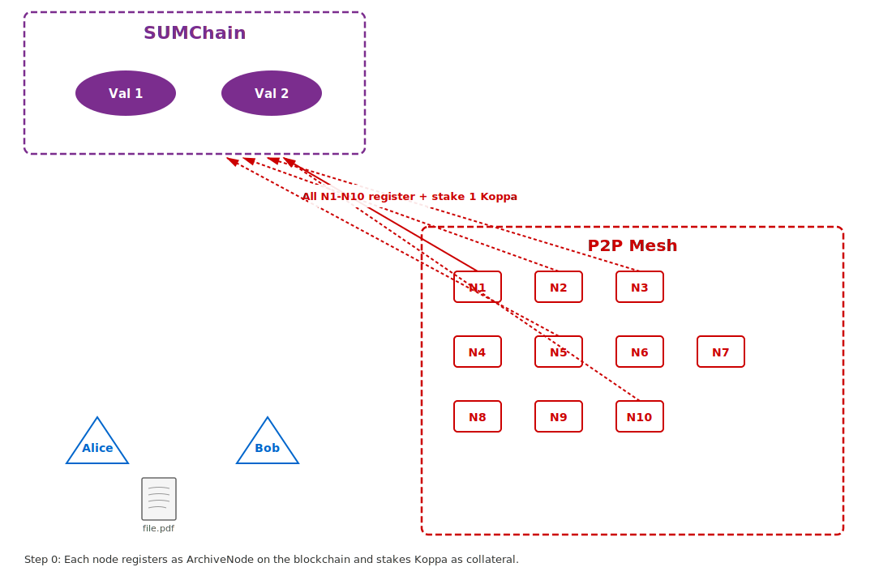
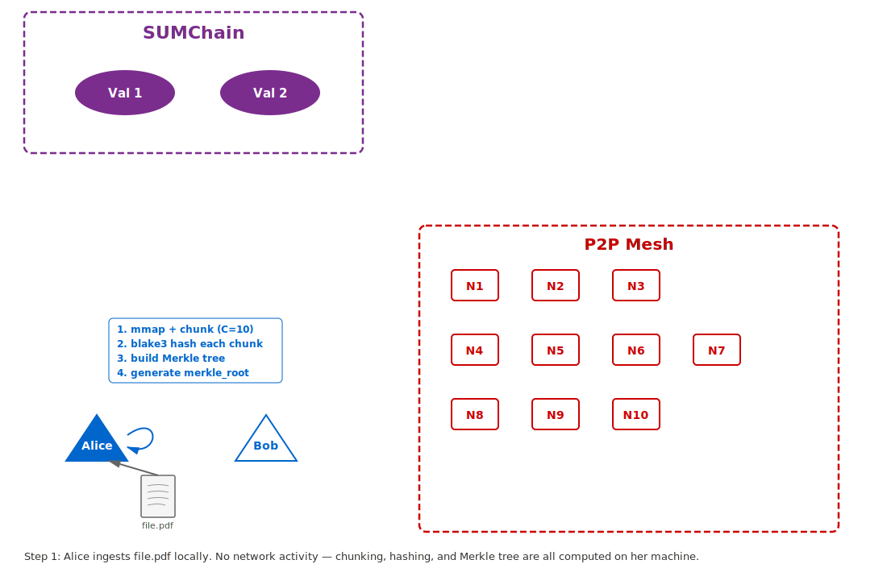
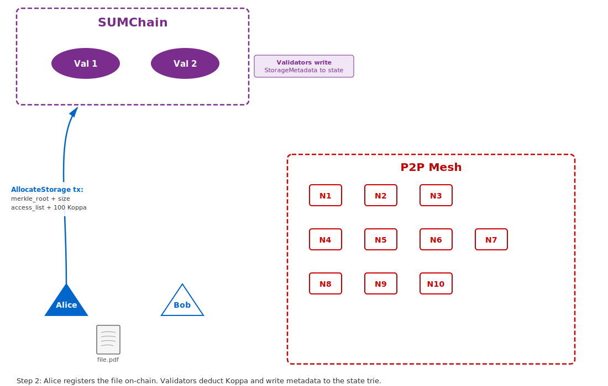
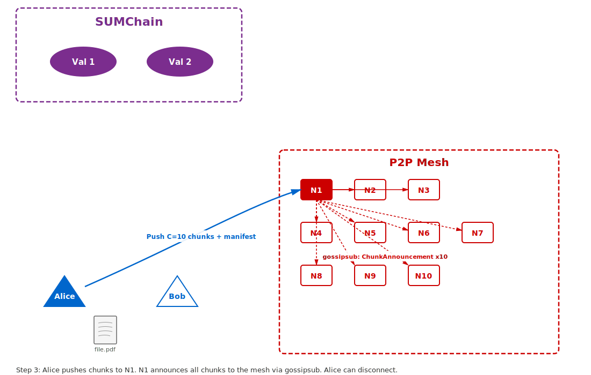
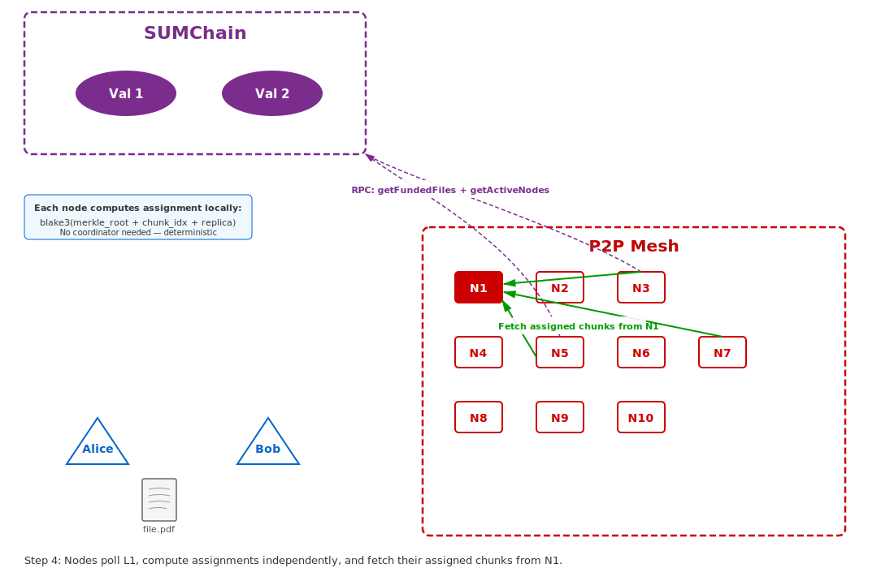
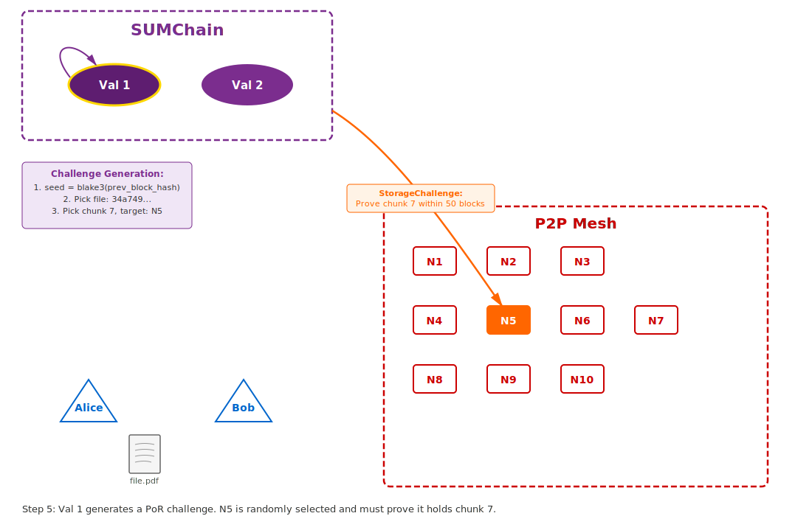
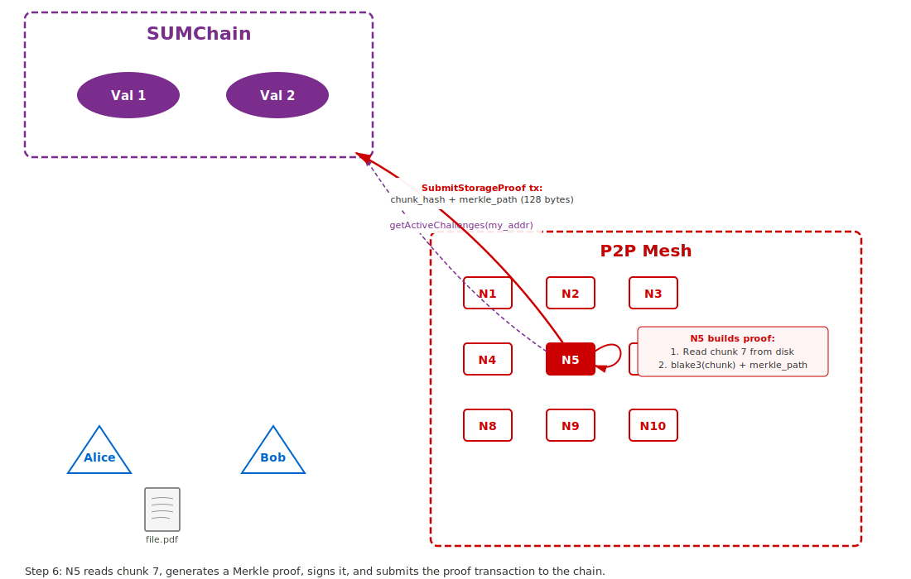
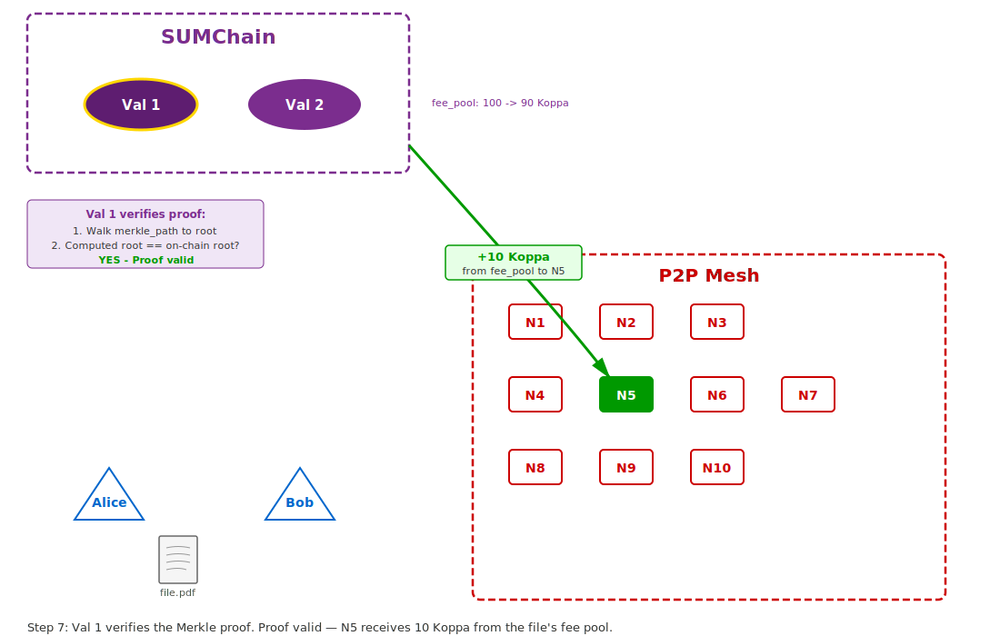
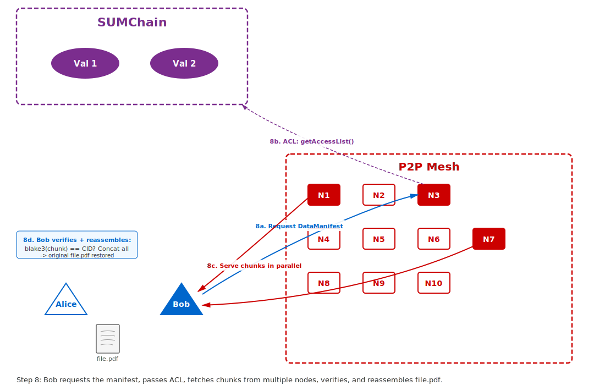

# Storage-Node-Interface-Protocol

A native decentralized storage protocol for the SUM Chain blockchain. The L1 acts as a cryptographic ledger — storing only merkle roots, access lists, and fee pools — while actual file data lives off-chain in a libp2p P2P mesh of storage nodes. Nodes earn Koppa by proving they hold data through randomized Proof of Retrievability challenges, with 3x replication enforced by a deterministic assignment algorithm that both the L1 and storage nodes compute identically from on-chain state. No smart contracts, no IPFS dependency — storage economics are settled directly at the consensus layer.

---

## The Complete SUM Chain Decentralized Storage Process

### The Actors

- **Val 1, Val 2** — Validator nodes running the SUM Chain blockchain. They maintain consensus, store metadata (never actual files), execute transactions, and issue Proof of Retrievability challenges. They are the "judges" of the network.
- **N1 through N10** — Storage nodes running the sum-storage-node daemon. They store actual file data on their hard drives, communicate with each other over a peer-to-peer (P2P) network, and talk to the validators via RPC (HTTP-based remote procedure calls). They are the "warehouse workers" of the network.
- **Alice** — A user (client) who wants to upload `file.pdf` to the network. Alice has a SUM Chain wallet with Koppa (the network's native currency) but does not run a storage node. She interacts with the network through a client application.
- **Bob** — A user who wants to download `file.pdf` later. Bob also has a SUM Chain wallet.

### The File

- `file.pdf` — 10,485,760 bytes (10 MB exactly)
- `C` = chunk count = `ceil(file_size / CHUNK_SIZE)` = `ceil(10,485,760 / 1,048,576)` = **10 chunks**
- `CHUNK_SIZE` = 1,048,576 bytes (1 MB) — a fixed constant, the same everywhere
- `R` = `REPLICATION_FACTOR` = 3 — each chunk is stored on 3 different nodes
- `N` = number of active storage nodes = 10

---

### Step 0 — Node Registration (one-time setup, each node does this independently)



Before any file storage can happen, each storage node must register itself on the blockchain. This is like applying for a license to participate in the storage market.

**What N1 does:**

1. N1 generates (or already has) an Ed25519 private key — a 32-byte secret number. This single key serves as both N1's blockchain wallet and its P2P network identity. From this key, two identities are derived:
   - **L1 Address** (20 bytes): `blake3(public_key)[12..32]` — how the blockchain identifies N1
   - **PeerId** (multihash of public key) — how other P2P nodes identify N1
   Both are derived from the same public key, so the blockchain can always map between them.

2. N1 creates a transaction: `TxPayload::NodeRegistry(Register { role: ArchiveNode })`. This says: "I want to be recognized as a storage node."

3. N1 must include a stake — a minimum of 1 Koppa locked as collateral. This stake exists as a financial threat: if N1 later fails to prove it holds data when challenged, the validators will destroy a percentage of this stake.

4. N1 signs the transaction with its Ed25519 private key (proving it controls this address) and broadcasts it to Val 1 or Val 2.

5. The validators execute the transaction:
   - Deduct the staked Koppa from N1's account balance
   - Write a `NodeRecord` to the blockchain's state database:
     ```
     {
       address: N1_address,
       role: ArchiveNode,
       staked_balance: 1,000,000,000 base units (1 Koppa),
       status: Active,
       registered_at: block 1000
     }
     ```

6. N1 starts the sum-storage-node daemon: `sum-node --key-file my_key.hex listen`. The daemon connects to the P2P mesh, begins discovering other nodes via mDNS, and starts its background workers (PorWorker, MarketSyncWorker).

**N2 through N10 each do the exact same process independently.** After all registrations, the blockchain's state database contains 10 `NodeRecord` entries, all with `status: Active`. Anyone can verify this by querying `storage_getActiveNodes()` via RPC.

---

### Step 1 — Alice ingests file.pdf (local processing)



Alice wants to store `file.pdf` (10 MB) on the decentralized network. She runs a client tool (or uses a client library) that performs the following operations locally on her machine. No network activity happens yet.

**Chunking:**

The file is memory-mapped (a technique that lets the operating system read the file directly from disk without copying all 10 MB into RAM) and sliced into uniform `CHUNK_SIZE` (1 MB) pieces:

| Chunk Index | Byte Offset | Size (bytes) | Note |
|-------------|-------------|--------------|------|
| 0 | 0 | 1,048,576 | Full 1 MB |
| 1 | 1,048,576 | 1,048,576 | Full 1 MB |
| 2 | 2,097,152 | 1,048,576 | Full 1 MB |
| 3 | 3,145,728 | 1,048,576 | Full 1 MB |
| 4 | 4,194,304 | 1,048,576 | Full 1 MB |
| 5 | 5,242,880 | 1,048,576 | Full 1 MB |
| 6 | 6,291,456 | 1,048,576 | Full 1 MB |
| 7 | 7,340,032 | 1,048,576 | Full 1 MB |
| 8 | 8,388,608 | 1,048,576 | Full 1 MB |
| 9 | 9,437,184 | 1,048,576 | Full 1 MB |

In this example, the file is exactly 10 MB, so all 10 chunks are full-sized. If the file were 10.5 MB, there would be 11 chunks — the last one would be 524,288 bytes (0.5 MB). The formula is: `C = ceil(file_size / CHUNK_SIZE)`.

**Hashing each chunk:**

Each chunk's raw bytes are hashed using BLAKE3, a cryptographic hash function that produces a 32-byte (256-bit) fingerprint. BLAKE3 is deterministic: the same input always produces the same output, and changing even one bit of input produces a completely different output.

```
H(0) = blake3(chunk_0_bytes) -> 32 bytes
H(1) = blake3(chunk_1_bytes) -> 32 bytes
...
H(9) = blake3(chunk_9_bytes) -> 32 bytes
```

**Merkle tree construction:**

The `C` = 10 chunk hashes become the **leaf nodes** of a binary Merkle tree. The tree is built bottom-up by repeatedly pairing adjacent hashes, concatenating them, and hashing the concatenation:

```
Level 0 (leaves):   H(0)  H(1)  H(2)  H(3)  H(4)  H(5)  H(6)  H(7)  H(8)  H(9)
                      \   /       \   /       \   /       \   /       \   /
Level 1:            H(0,1)      H(2,3)      H(4,5)      H(6,7)      H(8,9)
                       \         /              \         /              |
Level 2:           H(0,1,2,3)              H(4,5,6,7)              H(8,9,8,9)*
                          \                   /                       /
Level 3:            H(0-3, 4-7)                          H(8,9,8,9)
                              \                         /
Level 4 (root):              merkle_root
```

*When a level has an odd number of nodes, the last node is **duplicated** (hashed with itself). This is a critical detail — the L1 validators use this same rule, so both sides must agree.*

The final output is the **merkle_root** — a single 32-byte hash that uniquely represents the entire file. Example: `34a749797e853c5f3c6a678b881adee2103c66611f999082efff71bb75701b66`. If any byte in any chunk changes, the merkle_root changes.

**CID generation:**

Each chunk hash is also converted into a **CID** (Content Identifier) — a self-describing string that encodes the hash algorithm used and the hash value:
```
CID = base32lower( CIDv1_header + multihash(BLAKE3, chunk_hash) )
-> "bafkr4iblchqzqis3tr73bre2atjte5bzbifrleynael4j4vvoyreohcfge"
```

The CID serves as the chunk's address on the network and its filename on disk. Crucially, the merkle_root identifies the *file*, while each CID identifies a single *chunk*. One file has one merkle_root but `C` CIDs.

**DataManifest:**

All of this information is bundled into a `DataManifest`:
```
{
  file_name: "file.pdf",
  file_hash: blake3(entire_file),      // 32 bytes
  total_size_bytes: 10,485,760,        // 10 MB
  chunk_count: 10,                     // C = 10
  merkle_root: [34, a7, 49, ...],      // 32 bytes — the file's identity
  chunks: [
    { chunk_index: 0, offset: 0,         size: 1048576, blake3_hash: [...], cid: "bafkr4i..." },
    { chunk_index: 1, offset: 1048576,   size: 1048576, blake3_hash: [...], cid: "bafkr4ie..." },
    ... (8 more entries)
  ]
}
```

This manifest is serialized to disk as a CBOR file (a compact binary format, like JSON but smaller and binary-native).

---

### Step 2 — Alice registers the file on the blockchain



Alice now needs the blockchain to officially recognize this file. She creates and signs a `TxPayload::AllocateStorage` transaction containing:

- `merkle_root`: `34a749...` — the file's unique identity (32 bytes)
- `total_size_bytes`: 10,485,760
- `access_list`: `[Bob_address]` — only Bob is allowed to download this file. If Alice wanted the file to be public, she would leave this empty (`[]`).
- `fee_pool`: 100 Koppa — money locked to pay storage nodes over time. This is the economic fuel that keeps nodes motivated to store the file. When the fee pool runs out, nodes are no longer rewarded for storing it.

Alice signs this transaction with her Ed25519 private key and broadcasts it to Val 1 or Val 2.

The validators execute the transaction:
- Verify Alice's signature
- Deduct 100 Koppa from Alice's account
- Write a `StorageMetadata` entry to the blockchain's state database:
  ```
  {
    merkle_root: 34a749...,
    owner: Alice_address,
    total_size_bytes: 10,485,760,
    access_list: [Bob_address],
    fee_pool: 100,000,000,000 base units (100 Koppa),
    created_at: block 5000
  }
  ```

**The file now officially exists on the blockchain — but only as metadata.** The blockchain stores 32 bytes of merkle_root plus the rules (access list, fee pool). No actual PDF data touches the chain. The blockchain is a ledger of "what files exist, who owns them, who can access them, and how much money is set aside to pay for their storage."

---

### Step 3 — Alice pushes chunks to the P2P mesh



Alice connects to the P2P mesh and discovers nearby storage nodes via mDNS (multicast DNS — nodes broadcast "I'm here" on the local network). She finds N1.

Alice pushes all `C` = 10 chunks to N1 using the `/sum/storage/v1` request-response protocol over QUIC (a fast, encrypted transport protocol). N1 receives each chunk, verifies its CID (hashes the received bytes with blake3 and checks the result matches), and writes it to its local disk as `<cid>.chunk`.

Alice also sends the `DataManifest` to N1, which N1 stores in its manifest index (a persistent lookup table mapping merkle_root -> manifest).

N1 then publishes `C` = 10 `ChunkAnnouncement` messages via **gossipsub** — a pub/sub protocol where messages published to a named "topic" are forwarded to all nodes subscribed to that topic. The topic is `sum/storage/v1`.

Each of the 10 announcements contains:
- `merkle_root`: `34a749...` — which file this chunk belongs to
- `chunk_index`: 0 through 9 — which piece
- `cid`: the content address for requesting this specific chunk
- `size`: 1,048,576 bytes (or less for a final partial chunk)

N2 through N10 all receive all 10 announcements. Every node on the mesh now knows: "N1 holds chunks 0-9 of file `34a749...`"

Alice can now disconnect. Her job is done — the file is on N1 and registered on-chain. The network takes over from here.

---

### Step 4 — Storage nodes determine their assignments and fetch chunks



Each storage node runs a background task called the **MarketSyncWorker**. Every 30 seconds (configurable), it asks the blockchain two questions via RPC:

1. `storage_getFundedFiles()` -> "What files have money in their fee pool?" -> Returns file `34a749...` with `chunk_count = 10`
2. `storage_getActiveNodes()` -> "What storage nodes are registered and active?" -> Returns 10 addresses: `[N1_addr, N2_addr, ..., N10_addr]`, sorted by address bytes (alphabetical sort of raw bytes, ensuring every participant sorts identically)

Now each node independently runs the **deterministic assignment algorithm**. The goal: for each of the `C` = 10 chunks, determine which `R` = 3 of the `N` = 10 nodes should store a copy. No central coordinator decides this — every node computes the same answer independently because they all use the same public inputs.

**The algorithm:**

For each chunk (0 through `C-1`) and each replica (0 through `R-1`):

```
Step A: Concatenate three values into a 40-byte input:
   input = merkle_root (32 bytes) + chunk_index (4 bytes, big-endian) + replica (4 bytes, big-endian)

Step B: Hash the input:
   hash = blake3(input) -> 32 bytes

Step C: Convert to a node index:
   node_index = first_8_bytes_of_hash, interpreted as a 64-bit unsigned integer, modulo N (10)
   assigned_node = sorted_node_list[node_index]

Step D: Handle collisions:
   If this node was already assigned to this chunk by a previous replica,
   move to the next node in the list (linear probing) until finding one not yet assigned.
```

**Example result** (the actual assignment depends on the hash outputs, but this illustrates the pattern):

| Chunk | Replica 0 | Replica 1 | Replica 2 | Nodes NOT assigned |
|-------|-----------|-----------|-----------|-------------------|
| 0 | N3 | N7 | N1 | N2, N4, N5, N6, N8, N9, N10 |
| 1 | N5 | N2 | N9 | N1, N3, N4, N6, N7, N8, N10 |
| 2 | N1 | N10 | N4 | N2, N3, N5, N6, N7, N8, N9 |
| 3 | N8 | N3 | N6 | N1, N2, N4, N5, N7, N9, N10 |
| 4 | N2 | N6 | N10 | N1, N3, N4, N5, N7, N8, N9 |
| 5 | N7 | N1 | N5 | N2, N3, N4, N6, N8, N9, N10 |
| 6 | N4 | N9 | N2 | N1, N3, N5, N6, N7, N8, N10 |
| 7 | N10 | N5 | N8 | N1, N2, N3, N4, N6, N7, N9 |
| 8 | N6 | N4 | N3 | N1, N2, N5, N7, N8, N9, N10 |
| 9 | N9 | N8 | N7 | N1, N2, N3, N4, N5, N6, N10 |

In this example, each node stores approximately 3 chunks (30 total assignments across 10 nodes = ~3 per node), not all 10. With `R` = 3 and `N` = 10, storage overhead is 3x (30 chunk-copies for 10 original chunks), but each individual node only uses ~30% of the disk space that full replication would require.

**What N5 does (as an example):**

1. N5 computes the assignment table above
2. N5 filters: "which chunks have my address?" -> chunks 1, 5, 7
3. N5 checks its local disk: it has none of them
4. N5 knows from Step 3's gossipsub announcements that N1 holds all 10 chunks
5. N5 requests the `DataManifest` from N1 by sending a special request: `"manifest:34a749..."` over the `/sum/storage/v1` protocol. N1 responds with the CBOR-encoded manifest containing all 10 chunk CIDs, sizes, and offsets.
6. N5 sends `ShardRequest` messages to N1 for chunks 1, 5, and 7 (identified by their CIDs from the manifest)
7. For each received chunk, N5:
   - BLAKE3-hashes the received bytes
   - Compares the computed hash to the expected CID — if they don't match, the data was corrupted or tampered with in transit; reject it
   - Writes the verified chunk to disk as `<cid>.chunk`

**All 10 nodes perform this process simultaneously and independently.** After Step 4 completes, every chunk of file.pdf exists on exactly 3 nodes across the network. The file is fully distributed.

---

### Step 5 — Validators issue Proof of Retrievability (PoR) challenges



Every `CHALLENGE_INTERVAL_BLOCKS` = 100 blocks (roughly 100 seconds), the validators automatically generate a storage challenge. This is built into the block execution logic — no human triggers it. It is the mechanism by which the blockchain verifies that storage nodes are actually holding the data they were assigned.

**How a challenge is generated (inside Val 1's block execution at block 5100):**

1. **Seed generation:** The validator takes the previous block's hash (block 5099) and combines it with the string `"storage_challenge"` and the current block height to produce a deterministic but unpredictable seed:
   ```
   seed = blake3(block_5099_hash + "storage_challenge" + block_height_bytes)
   ```
   This seed is deterministic (all validators compute the same value) but unpredictable (nobody can predict it before block 5099 is finalized).

2. **Select a random file:** The validator queries all funded files (files with fee_pool > 0). It uses bytes from the seed to pick one:
   ```
   file_index = seed[0..8] as u64 % number_of_funded_files
   selected_file = funded_files[file_index]  ->  file "34a749..." (C = 10 chunks)
   ```

3. **Select a random chunk:**
   ```
   chunk_index = seed[8..12] as u32 % C  ->  chunk 7
   ```

4. **Determine who is assigned to chunk 7:** The validator runs the exact same deterministic assignment algorithm from Step 4, using the same sorted node list. Result: chunk 7 is assigned to [N10, N5, N8].

5. **Select a random assigned node:**
   ```
   target_index = seed[12..20] as u64 % 3  ->  index 1  ->  N5
   ```

6. **Write the challenge to the state database:**
   ```
   StorageChallenge {
     challenge_id: blake3(merkle_root + chunk_index + block_height),  // unique ID
     merkle_root: 34a749...,
     chunk_index: 7,
     target_node: N5_address,
     created_at_height: 5100,
     expires_at_height: 5150    // CHALLENGE_TTL_BLOCKS = 50
   }
   ```

**N5 now has 50 blocks to prove it holds chunk 7 of file `34a749...`.** If it fails, it loses 5% of its staked Koppa.

Note: The validators only challenge nodes that the assignment algorithm says should hold that chunk. N2, which is not assigned to chunk 7, will never be challenged for it.

---

### Step 6 — N5 responds with a cryptographic proof



N5's **PorWorker** (a background async task) polls the blockchain every few seconds: `storage_getActiveChallenges(my_address)`. It sees the challenge targeting it for chunk 7 of file `34a749...`.

N5 must now prove it holds chunk 7 without sending the entire 1 MB chunk on-chain (that would be far too expensive — blockchains are for small data, not megabytes). Instead, it constructs a **Merkle proof**: a compact set of sibling hashes that lets the validator mathematically verify that chunk 7 belongs to this file.

**What N5 does:**

1. **Read the chunk from disk:** N5 reads the file `<chunk_7_cid>.chunk` from its local store — 1,048,576 bytes.

2. **Hash the chunk:** `chunk_hash = blake3(chunk_7_bytes)` -> 32 bytes. This proves "I have data whose hash is this value."

3. **Load the DataManifest** for file `34a749...` from the manifest index. The manifest contains all 10 chunk hashes.

4. **Rebuild the Merkle tree** from the 10 stored chunk hashes (not the chunk data — just the 32-byte hashes, which are in the manifest).

5. **Generate the Merkle proof:** Call `generate_proof(chunk_index = 7)`. This walks from chunk 7's leaf up to the root, collecting the **sibling hash** at each level — the minimum information needed to reconstruct the path to the root:
   ```
   Proof for chunk 7 (index 7, binary = 0111):

   Level 0: Chunk 7's sibling is chunk 6    -> proof[0] = H(6)
   Level 1: Parent(6,7)'s sibling is Parent(4,5) -> proof[1] = H(4,5)
   Level 2: Parent(4-7)'s sibling is Parent(0-3) -> proof[2] = H(0,1,2,3)
   Level 3: Parent(0-7)'s sibling is Parent(8-9) -> proof[3] = H(8,9,8,9)

   merkle_path = [H(6), H(4,5), H(0-3), H(8-9,8-9)]  <-- 4 hashes = 128 bytes
   ```

   This is much smaller than sending the 1 MB chunk. The proof is `O(log2(C))` hashes — for 10 chunks, that's 4 hashes (128 bytes).

6. **Build the transaction:**
   ```
   TxPayload::SubmitStorageProof {
     challenge_id: <from the challenge>,
     merkle_root: 34a749...,
     chunk_index: 7,
     chunk_hash: <32 bytes>,
     merkle_path: [<32 bytes>, <32 bytes>, <32 bytes>, <32 bytes>]
   }
   ```

7. **Serialize, sign, and broadcast:** N5 serializes the transaction in the exact binary format the L1 expects (bincode v1 — a compact binary encoding that both sides must agree on byte-for-byte), hashes the serialized bytes with blake3, signs the hash with its Ed25519 private key, and broadcasts the signed transaction to the validators.

---

### Step 7 — Validators verify the proof and settle payment



Val 1 receives N5's proof transaction in the mempool and includes it in the next block. During block execution:

1. **Validate the challenge exists** in the state database and that N5 is the target node.

2. **Check expiry:** Current block height must be less than `expires_at_height` (5150). If the block is 5151 or later, the proof is too late.

3. **Verify the Merkle proof** — reconstruct the path from the chunk hash to the root using the sibling hashes:
   ```
   Start: current = chunk_hash

   Level 0: chunk_index=7, binary=0111, bit 0 is 1 -> current is RIGHT child
            current = blake3(proof[0] + current)        // H(6) + H(7)

   Level 1: index 3 (7/2=3), bit 1 is 1 -> current is RIGHT child
            current = blake3(proof[1] + current)        // H(4,5) + H(6,7)

   Level 2: index 1 (3/2=1), bit 2 is 0 -> current is LEFT child
            current = blake3(current + proof[2])        // H(0-3) + H(4-7) -- CORRECTED

   Level 3: index 0 (1/2=0), bit 3 is 0 -> current is LEFT child
            current = blake3(current + proof[3])        // H(0-7) + H(8-9)

   Final check: does current == merkle_root stored on-chain (34a749...)? -> YES
   ```

   The bit-checking rule `(chunk_index >> level) & 1` determines whether the current hash is the left or right child at each level. This must match exactly between the storage node's proof generation and the validator's verification — one bug here and every proof fails.

4. **Verify proof length:** The number of sibling hashes must equal `ceil(log2(C))`. For `C` = 10, that's 4. Too few or too many -> reject.

5. **Settlement (proof valid):**
   - Transfer `CHALLENGE_REWARD` = 10 Koppa from the file's `fee_pool` to N5's account
   - `fee_pool` decreases: 100 Koppa -> 90 Koppa
   - Delete the challenge from the state database
   - N5's stake remains untouched

6. **Settlement (proof missing — what happens if N5 never responds):**
   If block 5150 arrives and no valid proof has been submitted:
   - The validator's `process_expired_challenges()` runs at the **start** of block 5150 (before any user transactions, preventing front-running)
   - `SLASH_PERCENTAGE` = 5% of N5's staked balance is destroyed
   - N5's status is set to `Slashed` — it is no longer considered an active node
   - The challenge is deleted
   - N5 receives nothing from the fee pool

This cycle repeats continuously — every 100 blocks, a new random challenge targets a random chunk on a random assigned node. Over time, honest nodes that actually store their assigned data accumulate Koppa. Nodes that cheat (claim to store data but don't) get repeatedly slashed until their stake is depleted and they are ejected from the network.

---

### Step 8 — Bob downloads file.pdf



Bob knows the file's `merkle_root` (`34a749...`) — Alice shared it with him. The merkle_root is the file's permanent address on the SUM network. Bob wants to reconstruct the original file.pdf.

**Step 8a — Get the manifest:**

Bob connects to the P2P mesh and discovers nearby storage nodes via mDNS. He finds N3. Bob sends a manifest request: `"manifest:34a749797e853c5f3c6a678b881adee2103c66611f999082efff71bb75701b66"` to N3 over the `/sum/storage/v1` protocol.

N3 looks up the merkle_root in its manifest index and responds with the full `DataManifest` (CBOR-encoded). Bob now knows:
- The file has `C` = 10 chunks
- Each chunk's CID (content address), size, and offset
- The file's total size: 10,485,760 bytes

**Step 8b — Access control check:**

Before any node serves Bob a chunk, it queries the blockchain: `storage_getAccessList(34a749...)`. The response comes back: `access_list: [Bob_address]`.

The node derives Bob's L1 address from his P2P identity. When Bob connected, the libp2p **identify** protocol automatically exchanged public keys. The node computes: `blake3(Bob_public_key)[12..32]` -> Bob's L1 address. It checks: is Bob's address in the access list? **Yes** -> access granted.

If a different user (Carol) tried to download the same file, her derived L1 address would not be in `[Bob_address]`, and the serving node would drop the connection. If the access_list were empty (`[]`), it would mean the file is public and anyone could download it.

**Step 8c — Fetch all chunks:**

Bob iterates through the manifest's 10 chunk entries. For each chunk, he sends a `ShardRequest` to any node that has it:

```
ShardRequest {
  cid: "bafkr4iblchqzqis3tr73bre2atjte5bzbifrleynael4j4vvoyreohcfge",  // which chunk
  offset: None,      // start from the beginning
  max_bytes: None,   // send the whole thing
}
```

The serving node:
1. Looks up the CID in its chunk store
2. Memory-maps the chunk file from disk (zero-copy — no RAM allocation for the 1 MB)
3. Sends a `ShardResponse` back with the raw bytes:
   ```
   ShardResponse {
     cid: "bafkr4i...",
     offset: 0,
     total_bytes: 1048576,
     data: [1,048,576 bytes of chunk data],
     error: None,
   }
   ```

Bob can fetch from different nodes in parallel — chunk 0 from N3, chunk 1 from N7, chunk 2 from N1, etc. Since each chunk exists on 3 nodes, Bob has multiple sources for each one. If N3 goes offline mid-download, Bob can retry the same chunk from another node that holds it.

**Step 8d — Verify and reassemble:**

For each received chunk, Bob:
1. BLAKE3-hashes the received bytes
2. Verifies the hash matches the CID from the manifest — if it doesn't match, the data was corrupted or tampered with; discard and retry from another node
3. Stores the verified chunk

Once all `C` = 10 chunks are downloaded and verified, Bob concatenates them in order (chunk 0 + chunk 1 + ... + chunk 9) to reconstruct the original `file.pdf`. The file is byte-for-byte identical to what Alice uploaded — guaranteed by the cryptographic hashes.

Bob can optionally verify the entire file by building the Merkle tree from his 10 chunk hashes and checking that the computed merkle_root matches `34a749...`. If it does, he has cryptographic proof that his reconstructed file is exactly what Alice registered on the blockchain.

---

## Summary

| Layer | What it knows | What it stores |
|-------|--------------|----------------|
| **Blockchain (Val 1, Val 2)** | File identities (merkle_root), ownership, access rules, fee pools, node registrations, challenge/proof history | Metadata only — never file data. ~100 bytes per file. |
| **Storage nodes (N1-N10)** | Which chunks they hold, which peers have what, their assignment | Actual file chunks on disk. ~3 MB per node for a 10 MB file with 10 nodes. |
| **Uploader (Alice)** | The merkle_root of her file | Nothing after upload — she can delete her local copy. |
| **Downloader (Bob)** | The merkle_root (shared by Alice) | The reconstructed file after download. |

**No central server.** Files are spread across independent nodes that don't trust each other.

**No file data on-chain.** The blockchain stores 32 bytes of merkle_root per file, keeping it lightweight.

**Economic security.** Nodes post collateral (stake). Honest storage earns Koppa. Cheating costs Koppa. The math makes honesty the only profitable long-term strategy.

**Deterministic coordination.** No central coordinator assigns work. Every participant independently computes the same assignment from public on-chain data using the same hash function with the same inputs.

**Cryptographic integrity.** Every chunk is content-addressed (CID = hash of contents). Every Merkle proof is mathematically verifiable. You cannot fake a proof without possessing the actual data.
