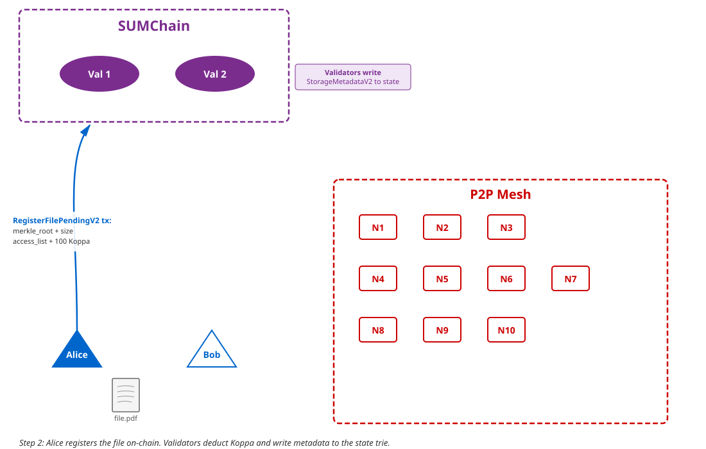
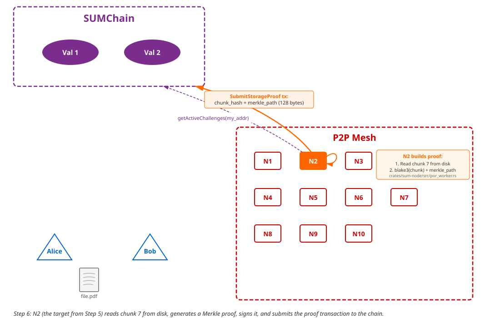
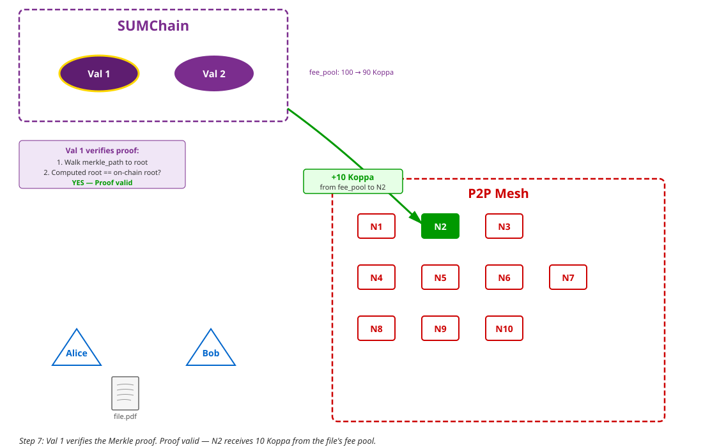
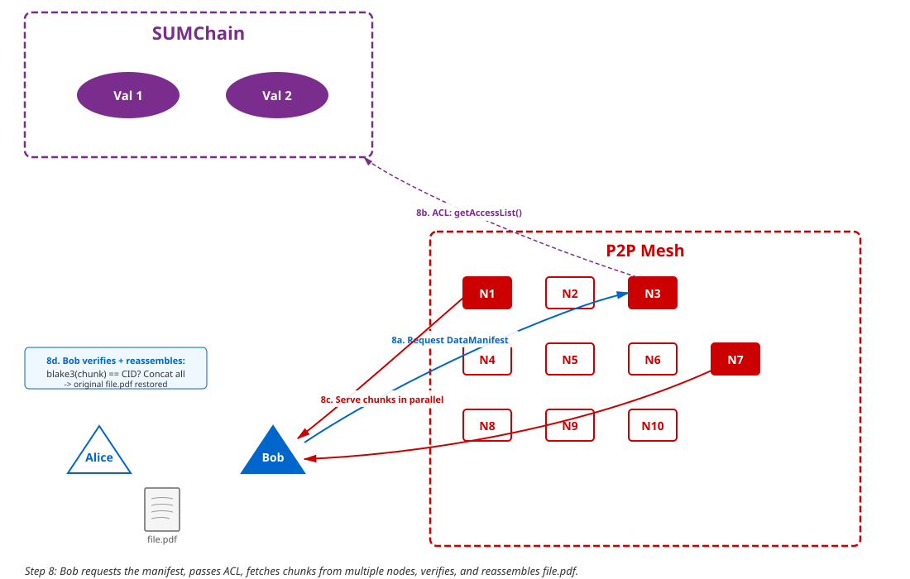

# Storage-Node-Interface-Protocol

A native decentralized storage protocol for the SUM Chain blockchain. The L1 acts as a cryptographic ledger — storing only merkle roots, access lists, and fee pools — while actual file data lives off-chain in a libp2p P2P mesh of storage nodes. Nodes earn Koppa by proving they hold data through randomized Proof of Retrievability challenges, with 3x replication enforced by a deterministic assignment algorithm that both the L1 and storage nodes compute identically from on-chain state. No smart contracts, no IPFS dependency — storage economics are settled directly at the consensus layer.

---

## Platform support

Client mode (file user) and archive mode (long-running operator)
have different platform stories:

| Environment | Client | Archive |
|---|---|---|
| Linux | ✅ Supported | ✅ Supported |
| macOS (Apple Silicon) | ✅ Supported | ⚠️ Experimental |
| Windows (via WSL2) | ⚠️ With caveats | ❌ Not supported |
| ChromeOS (via Crostini) | ⚠️ With caveats | ❌ Not supported |

Archive operation is Linux-first; macOS may join after one
operator's long-run validation completes. Windows and ChromeOS
users run SNIP as clients through their Linux-compatible
environments (WSL2 / Crostini). For the full matrix, rationale,
per-environment setup recipes, promotion criteria, and items
not planned for `v0.4.x`, see
[`docs/PLATFORM-SUPPORT.md`](docs/PLATFORM-SUPPORT.md).

---

## Install

Prebuilt binaries are published for **Linux x86_64**. Every other
supported platform builds from source — see
[`docs/INSTALL.md`](docs/INSTALL.md) and
[`docs/PLATFORM-SUPPORT.md`](docs/PLATFORM-SUPPORT.md) for
per-environment recipes.

The recommended first install is the **manual-verify path**
(download → check SHA256 → extract → move binaries). See
[`docs/INSTALL.md`](docs/INSTALL.md) for the step-by-step
commands.

A curl-pipe convenience script is also published with each
release. It requires you to pin a version explicitly — there is
no `--latest`:

```bash
# Replace v0.4.0 with the release you want to install.
curl -fsSL https://github.com/SUM-INNOVATION/Storage-Node-Interface-Protocol/releases/download/v0.4.0/install.sh \
    | sh -s -- --version v0.4.0
```

The script installs `sum-node` and `e2e-helper` into
`$HOME/.local/bin` by default. It refuses to run on anything
other than Linux x86_64 and does not invoke `sudo` itself. To
install system-wide, run the curl-pipe under your own `sudo` and
pass `--prefix /usr/local`.

---

## The Complete SUM Chain Decentralized Storage Process

### The Actors

- **Val 1, Val 2** — Validator nodes running the SUM Chain blockchain. They maintain consensus, store metadata (never actual files), execute transactions, and issue Proof of Retrievability challenges. They are the "judges" of the network.
- **N1 through N10** — Storage nodes running the sum-storage-node daemon. They store actual file data on their hard drives, communicate with each other over a peer-to-peer (P2P) network, and talk to the validators via RPC (HTTP-based remote procedure calls). They are the "warehouse workers" of the network.
- **Alice** — A user (client) who wants to upload `file.pdf` to the network. Alice has a SUM Chain wallet with Koppa (the network's native currency) but does not run a storage node. She interacts with the network through a client application.
- **Bob** — A user who wants to download `file.pdf` later. Bob also has a SUM Chain wallet.

### The File

- `file.pdf` — 10,485,760 bytes (10 MB exactly)
- `C` = chunk count = `ceil(file_size / CHUNK_SIZE)` = `ceil(10,485,760 / 1,048,576)` = **10 chunks**
- `CHUNK_SIZE` = 1,048,576 bytes (1 MB) — a fixed constant, the same everywhere
- `R` = `REPLICATION_FACTOR` = 3 — each chunk is stored on 3 different nodes
- `N` = number of active storage nodes = 10

---

### Step 0 — Node Registration (one-time setup, each node does this independently)


Before any file storage can happen, each storage node must register itself on the blockchain. This is like applying for a license to participate in the storage market.

**What N1 does:**

1. N1 generates (or already has) an Ed25519 private key — a 32-byte secret number. This single key serves as both N1's blockchain wallet and its P2P network identity. From this key, two identities are derived:
   - **L1 Address** (20 bytes): `blake3(public_key)[12..32]` — how the blockchain identifies N1
   - **PeerId** (multihash of public key) — how other P2P nodes identify N1
   Both are derived from the same public key, so the blockchain can always map between them.

2. N1 creates a transaction: `TxPayload::NodeRegistry(Register { role: ArchiveNode })`. This says: "I want to be recognized as a storage node."

3. N1 must include a stake — a minimum of 1 Koppa locked as collateral. This stake exists as a financial threat: if N1 later fails to prove it holds data when challenged, the validators will destroy a percentage of this stake.

4. N1 signs the transaction with its Ed25519 private key (proving it controls this address) and broadcasts it to Val 1 or Val 2.

5. The validators execute the transaction:
   - Deduct the staked Koppa from N1's account balance
   - Write a `NodeRecord` to the blockchain's state database:
     ```
     {
       address: N1_address,
       role: ArchiveNode,
       staked_balance: 1,000,000,000 base units (1 Koppa),
       status: Active,
       registered_at: block 1000
     }
     ```

6. N1 starts the sum-storage-node daemon: `sum-node --key-file my_key.hex listen`. The daemon connects to the P2P mesh, begins discovering other nodes via mDNS, and starts its background workers (PorWorker, MarketSyncWorker).

**N2 through N10 each do the exact same process independently.** After all registrations, the blockchain's state database contains 10 `NodeRecord` entries, all with `status: Active`. Anyone can verify this by querying `storage_getActiveNodesAtHeight(height)` via RPC.

---

### Step 1 — Alice ingests file.pdf (local processing)


Alice wants to store `file.pdf` (10 MB) on the decentralized network. She runs a client tool (or uses a client library) that performs the following operations locally on her machine. No network activity happens yet.

**Chunking:**

The file is memory-mapped (a technique that lets the operating system read the file directly from disk without copying all 10 MB into RAM) and sliced into uniform `CHUNK_SIZE` (1 MB) pieces:

| Chunk Index | Byte Offset | Size (bytes) | Note |
|-------------|-------------|--------------|------|
| 0 | 0 | 1,048,576 | Full 1 MB |
| 1 | 1,048,576 | 1,048,576 | Full 1 MB |
| 2 | 2,097,152 | 1,048,576 | Full 1 MB |
| 3 | 3,145,728 | 1,048,576 | Full 1 MB |
| 4 | 4,194,304 | 1,048,576 | Full 1 MB |
| 5 | 5,242,880 | 1,048,576 | Full 1 MB |
| 6 | 6,291,456 | 1,048,576 | Full 1 MB |
| 7 | 7,340,032 | 1,048,576 | Full 1 MB |
| 8 | 8,388,608 | 1,048,576 | Full 1 MB |
| 9 | 9,437,184 | 1,048,576 | Full 1 MB |

In this example, the file is exactly 10 MB, so all 10 chunks are full-sized. If the file were 10.5 MB, there would be 11 chunks — the last one would be 524,288 bytes (0.5 MB). The formula is: `C = ceil(file_size / CHUNK_SIZE)`.

**Hashing each chunk:**

Each chunk's raw bytes are hashed using BLAKE3, a cryptographic hash function that produces a 32-byte (256-bit) fingerprint. BLAKE3 is deterministic: the same input always produces the same output, and changing even one bit of input produces a completely different output.

```
H(0) = blake3(chunk_0_bytes) -> 32 bytes
H(1) = blake3(chunk_1_bytes) -> 32 bytes
...
H(9) = blake3(chunk_9_bytes) -> 32 bytes
```

**Merkle tree construction:**

The `C` = 10 chunk hashes become the **leaf nodes** of a binary Merkle tree. The tree is built bottom-up by repeatedly pairing adjacent hashes, concatenating them, and hashing the concatenation:

```
Level 0 (leaves):   H(0)  H(1)  H(2)  H(3)  H(4)  H(5)  H(6)  H(7)  H(8)  H(9)
                      \   /       \   /       \   /       \   /       \   /
Level 1:            H(0,1)      H(2,3)      H(4,5)      H(6,7)      H(8,9)
                       \         /              \         /              |
Level 2:           H(0,1,2,3)              H(4,5,6,7)              H(8,9,8,9)*
                          \                   /                       /
Level 3:            H(0-3, 4-7)                          H(8,9,8,9)
                              \                         /
Level 4 (root):              merkle_root
```

*When a level has an odd number of nodes, the last node is **duplicated** (hashed with itself). This is a critical detail — the L1 validators use this same rule, so both sides must agree.*

The final output is the **merkle_root** — a single 32-byte hash that uniquely represents the entire file. Example: `34a749797e853c5f3c6a678b881adee2103c66611f999082efff71bb75701b66`. If any byte in any chunk changes, the merkle_root changes.

**CID generation:**

Each chunk hash is also converted into a **CID** (Content Identifier) — a self-describing string that encodes the hash algorithm used and the hash value:
```
CID = base32lower( CIDv1_header + multihash(BLAKE3, chunk_hash) )
-> "bafkr4iblchqzqis3tr73bre2atjte5bzbifrleynael4j4vvoyreohcfge"
```

The CID serves as the chunk's address on the network and its filename on disk. Crucially, the merkle_root identifies the *file*, while each CID identifies a single *chunk*. One file has one merkle_root but `C` CIDs.

**DataManifest:**

All of this information is bundled into a `DataManifest`:
```
{
  file_name: "file.pdf",
  file_hash: blake3(entire_file),      // 32 bytes
  total_size_bytes: 10,485,760,        // 10 MB
  chunk_count: 10,                     // C = 10
  merkle_root: [34, a7, 49, ...],      // 32 bytes — the file's identity
  chunks: [
    { chunk_index: 0, offset: 0,         size: 1048576, blake3_hash: [...], cid: "bafkr4i..." },
    { chunk_index: 1, offset: 1048576,   size: 1048576, blake3_hash: [...], cid: "bafkr4ie..." },
    ... (8 more entries)
  ]
}
```

This manifest is serialized to disk as a CBOR file (a compact binary format, like JSON but smaller and binary-native).

---

### Step 2 — Alice registers the file on the blockchain



Alice now needs the blockchain to officially recognize this file. She creates and signs a `RegisterFilePendingV2` transaction ([crates/sum-node/src/tx_builder.rs:115-147](crates/sum-node/src/tx_builder.rs#L115-L147)) containing:

- `merkle_root`: `34a749...` — the file's unique identity (32 bytes)
- `plaintext_size_bytes`: 10,485,760
- `chunk_count`: 10
- `visibility`: `Public` (or `Private` — see the V2 Lifecycle section below for the encrypted-file flow)
- `access_list`: `[]` for a Public file; for Private, one `AccessEntryV2` per recipient carrying an 80-byte encrypted key bundle ([crates/sum-types/src/rpc_types.rs:122-131](crates/sum-types/src/rpc_types.rs#L122-L131))
- `fee_deposit`: 100 Koppa — money locked to pay storage nodes over time. This is the economic fuel that keeps nodes motivated to store the file. When the fee pool runs out, nodes are no longer rewarded for storing it.

Alice signs this transaction with her Ed25519 private key, broadcasts it via JSON-RPC `send_raw_transaction`, and waits for `Finalized` ([crates/sum-node/src/tx_wait.rs:88-132](crates/sum-node/src/tx_wait.rs#L88-L132)).

The validators execute the transaction:
- Verify Alice's signature
- Deduct 100 Koppa from Alice's account as the fee deposit
- Write a `StorageMetadataV2` entry to the blockchain's state database ([crates/sum-types/src/rpc_types.rs:134-176](crates/sum-types/src/rpc_types.rs#L134-L176)):
  ```
  {
    merkle_root: 34a749...,
    owner: Alice_address,
    plaintext_size_bytes: 10,485,760,
    stored_size_bytes:    10,485,760,   // = plaintext for Public; plaintext + 16×chunk_count for Private
    chunk_count: 10,
    visibility: Public,
    lifecycle:  Pending,                 // becomes Active after ActivateFileV2
    access_list: [],
    fee_pool: 100,000,000,000 base units (100 Koppa),
    created_at: block 5000,
    assignment_height: 5000              // chain captures this snapshot for deterministic chunk assignment
  }
  ```

**The file now officially exists on the blockchain — but only as metadata, and only in `Pending` state.** The blockchain stores 32 bytes of merkle_root plus the rules (visibility, access list, fee pool). No actual PDF data touches the chain. The file becomes downloadable after Alice pushes chunks (Step 3), archives attest coverage (Step 4), and Alice submits `ActivateFileV2` to transition Pending → Active.

---

### Step 3 — Alice pushes chunks to the P2P mesh


Alice runs:
```bash
sum-node --client --key-file alice.hex --rpc-url http://<validator>:9944 ingest-v2 file.pdf
```

Her client connects to the P2P mesh and discovers nearby storage nodes via mDNS (multicast DNS — nodes broadcast "I'm here" on the local network). Alice does not need to register as an ArchiveNode, stake Koppa, or run storage infrastructure — she is an external user of the network.

Alice does **not** push to a single node. Instead, she runs the V2 deterministic assignment algorithm described in Step 4 — she queries the L1 for the active-node snapshot at `assignment_height` (`storage_getActiveNodesAtHeight`, [crates/sum-node/src/rpc_client.rs:228-234](crates/sum-node/src/rpc_client.rs#L228-L234)) and computes the top-`R` = 3 archives per chunk via `chunks_for_archive_v2` ([crates/sum-store/src/assignment_v2.rs:151-178](crates/sum-store/src/assignment_v2.rs#L151-L178)). She then pushes each chunk directly to its 3 assigned archives in parallel using the `/sum/storage/v2` push protocol over QUIC (a fast, encrypted transport protocol).

Each V2 push carries the chunk bytes alongside an inline Merkle proof — `ShardRequestV2::Push { data, merkle_root, chunk_index, merkle_path }` ([crates/sum-net/src/codec.rs:176-207](crates/sum-net/src/codec.rs#L176-L207)). The receiving node validates four things via `PushValidator::validate_push` ([crates/sum-node/src/push_validator.rs:255](crates/sum-node/src/push_validator.rs#L255)) **before** writing anything to disk:

1. The file is registered on chain and not Abandoned (`storage_getFileInfoV2`)
2. `chunk_index < chunk_count`
3. The receiving archive is in the snapshot AND is one of the V2-assigned archives for this `chunk_index`
4. `verify_merkle_proof_bytes_for_tree(blake3(data), chunk_index, merkle_path, merkle_root, chunk_count)` succeeds ([crates/sum-store/src/verify.rs:72-95](crates/sum-store/src/verify.rs#L72-L95))

Only after all four checks pass does the node write the chunk to its local disk as `<cid>.chunk` ([crates/sum-store/src/store.rs:39-43](crates/sum-store/src/store.rs#L39-L43)) and respond with `PushAck`. The wire CID is never trusted — the leaf hash is derived from `data` itself.

After Alice's pushes complete, she also sends the `DataManifest` to each distinct assigned archive via `ManifestPushV2` ([crates/sum-net/src/lib.rs:249-265](crates/sum-net/src/lib.rs#L249-L265), variant defined at [crates/sum-net/src/codec.rs:201](crates/sum-net/src/codec.rs#L201)). The receiver recomputes the merkle root from the manifest's chunk descriptors and rejects on mismatch ([crates/sum-store/src/serve.rs:418-488](crates/sum-store/src/serve.rs#L418-L488)). Alice then publishes one `ChunkAnnouncement` per chunk — `C` total — on the `sum/storage/v1` Gossipsub topic ([crates/sum-store/src/announce.rs:11-20](crates/sum-store/src/announce.rs#L11-L20)) so other peers can discover the CIDs. Each announcement contains:

- `merkle_root`: `34a749...` — which file this chunk belongs to
- `chunk_index`: 0 through 9 — which piece
- `chunk_cid`: the content address for requesting this specific chunk
- `size_bytes`: 1,048,576 bytes (or less for a final partial chunk)

**Alice waits for confirmation before disconnecting.** She tracks `PushAck` responses from each target archive. Only after every assigned archive has accepted each of its chunks (or the wall-clock timeout `--push-wait-secs` elapses, default 120 s — [crates/sum-node/src/main.rs:172-173](crates/sum-node/src/main.rs#L172-L173)) does she move on to Step 4's coverage poll.

---

### Step 4 — Storage nodes determine their assignments and fetch chunks


Each storage node independently runs the **V2 deterministic assignment algorithm** that Alice already ran in Step 3 to choose her push targets. The goal: for each of the `C` = 10 chunks, determine which `R` = 3 of the `N` = 10 nodes should store a copy. No central coordinator decides this — every participant (Alice, every archive, the L1 validators) computes the same answer independently because they all use the same public on-chain inputs.

Each archive queries the L1 for the snapshot pinned at the file's `assignment_height` and reads chain params for `R`:

1. `storage_getActiveNodesAtHeight(assignment_height)` ([crates/sum-node/src/rpc_client.rs:228-234](crates/sum-node/src/rpc_client.rs#L228-L234)) -> "What storage nodes were active when this file was registered?" -> Returns 10 addresses: `[N1_addr, ..., N10_addr]`, canonicalized via `BTreeSet` (deduped + sorted by address bytes — every participant sorts identically).
2. `chain_getChainParams()` ([crates/sum-types/src/rpc_types.rs:213-258](crates/sum-types/src/rpc_types.rs#L213-L258)) -> reads `assignment_replication_factor` (default 3).

**The algorithm** (rendezvous hash, [crates/sum-store/src/assignment_v2.rs:52-112](crates/sum-store/src/assignment_v2.rs#L52-L112)):

For each `(chunk_index, archive)` pair, compute a score:

```
Step A: Domain-separation context (exact bytes — consensus-critical):
   context = "sumchain SNIP-V2 chunk-assignment v1"

Step B: Derive a 32-byte key:
   key = blake3::derive_key(context, merkle_root || chunk_index_be || archive_l1_address)

Step C: Convert to a 64-bit score:
   score = u64::from_be_bytes(key[..8])

Step D: Select the R archives with the lowest scores for this chunk.
   Tie-break: ascending by archive L1 address (canonical sort of the snapshot).
```

The context string, big-endian byte order, `blake3::derive_key` variant, and tie-break rule MUST match the L1's validation exactly. Any divergence breaks chain conformance.

**Example result** (the actual assignment depends on the rendezvous-hash scores, but this illustrates the pattern):

| Chunk | Replica 0 | Replica 1 | Replica 2 | Nodes NOT assigned |
|-------|-----------|-----------|-----------|-------------------|
| 0 | N3 | N7 | N1 | N2, N4, N5, N6, N8, N9, N10 |
| 1 | N5 | N2 | N9 | N1, N3, N4, N6, N7, N8, N10 |
| 2 | N1 | N10 | N4 | N2, N3, N5, N6, N7, N8, N9 |
| 3 | N8 | N3 | N6 | N1, N2, N4, N5, N7, N9, N10 |
| 4 | N2 | N6 | N10 | N1, N3, N4, N5, N7, N8, N9 |
| 5 | N7 | N1 | N5 | N2, N3, N4, N6, N8, N9, N10 |
| 6 | N4 | N9 | N2 | N1, N3, N5, N6, N7, N8, N10 |
| 7 | N10 | N5 | N8 | N1, N2, N3, N4, N6, N7, N9 |
| 8 | N6 | N4 | N3 | N1, N2, N5, N7, N8, N9, N10 |
| 9 | N9 | N8 | N7 | N1, N2, N3, N4, N5, N6, N10 |

In this example, each node stores approximately 3 chunks (30 total assignments across 10 nodes = ~3 per node), not all 10. With `R` = 3 and `N` = 10, storage overhead is 3x (30 chunk-copies for 10 original chunks), but each individual node only uses ~30% of the disk space that full replication would require.

**What N5 does (as an example):**

1. N5 calls `chunks_for_archive_v2(merkle_root, chunk_count, snapshot, R, my_addr)` ([crates/sum-store/src/assignment_v2.rs:151-178](crates/sum-store/src/assignment_v2.rs#L151-L178)) and gets the `BTreeSet` of chunk indices it owns -> chunks 1, 5, 7.
2. N5 checks its local disk: it already has chunks 1, 5, 7 — Alice's V2 pushes from Step 3 each carried a Merkle proof that N5's `PushValidator` already verified before writing.
3. N5 attests on chain by submitting `AcceptAssignmentV2` ([crates/sum-node/src/tx_builder.rs:190-205](crates/sum-node/src/tx_builder.rs#L190-L205), driven by [crates/sum-node/src/assignment_attestor.rs](crates/sum-node/src/assignment_attestor.rs)) carrying `chunk_indices: [1, 5, 7]`. The chain OR-merges those bits into N5's per-`(file, archive)` bitmap. Files whose per-archive assignment exceeds `max_chunk_indices_per_tx` (default 65,536 — [crates/sum-types/src/rpc_types.rs:228-231](crates/sum-types/src/rpc_types.rs#L228-L231)) split across multiple OR-merge txs that compose into the same bitmap.

Attestation runs as a `tokio::spawn`'d task from the V2 inbound dispatcher's manifest-push handler ([crates/sum-node/src/inbound_v2.rs](crates/sum-node/src/inbound_v2.rs)) so inbound request latency is decoupled from chain finality.

**All assigned archives perform this process independently.** Alice polls `storage_getAssignmentCoverageV2` ([crates/sum-node/src/rpc_client.rs:279-290](crates/sum-node/src/rpc_client.rs#L279-L290)) until `can_activate_now == true` (every chunk has at least one currently-`Active` accepting archive), then submits `ActivateFileV2` ([crates/sum-node/src/tx_builder.rs:150-161](crates/sum-node/src/tx_builder.rs#L150-L161)). On finalization the file transitions Pending → Active and PoR challenges become eligible after `activated_at_height + activation_grace_blocks`.

For V2 files there is no MarketSync-driven re-fetch loop — chain-side PoR challenges plus slashing (Steps 5–7) enforce retention. The `MarketSyncWorker` background task ([crates/sum-node/src/market_sync.rs:30](crates/sum-node/src/market_sync.rs#L30), spawned from `run_listen` at [crates/sum-node/src/main.rs:661](crates/sum-node/src/main.rs#L661)) remains alive as a V1-legacy compatibility worker that polls `storage_getFundedFiles` + `storage_getActiveNodes` and self-heals V1-registered files via the older hash + linear-probe algorithm in [crates/sum-store/src/assignment.rs](crates/sum-store/src/assignment.rs); it does not drive V2 retention.

After Step 4 completes, every chunk of file.pdf is held by its `R` = 3 deterministically-assigned archives, attested on chain, and the file is downloadable.

---

### Step 5 — Validators issue Proof of Retrievability (PoR) challenges


Every `CHALLENGE_INTERVAL_BLOCKS` = 100 blocks (roughly 100 seconds), the validators automatically generate a storage challenge. This is built into the block execution logic — no human triggers it. It is the mechanism by which the blockchain verifies that storage nodes are actually holding the data they were assigned.

**How a challenge is generated (inside Val 1's block execution at block 5100):**

1. **Seed generation:** The validator takes the previous block's hash (block 5099) and combines it with the string `"storage_challenge"` and the current block height to produce a deterministic but unpredictable seed:
   ```
   seed = blake3(block_5099_hash + "storage_challenge" + block_height_bytes)
   ```
   This seed is deterministic (all validators compute the same value) but unpredictable (nobody can predict it before block 5099 is finalized).

2. **Select a random file:** The validator queries all funded files (files with fee_pool > 0). It uses bytes from the seed to pick one:
   ```
   file_index = seed[0..8] as u64 % number_of_funded_files
   selected_file = funded_files[file_index]  ->  file "34a749..." (C = 10 chunks)
   ```

3. **Select a random chunk:**
   ```
   chunk_index = seed[8..12] as u32 % C  ->  chunk 7
   ```

4. **Determine who is assigned to chunk 7:** The validator runs the exact same deterministic assignment algorithm from Step 4, using the same sorted node list. Result: chunk 7 is assigned to [N10, N5, N8].

5. **Select a random assigned node:**
   ```
   target_index = seed[12..20] as u64 % 3  ->  index 1  ->  N5
   ```

6. **Write the challenge to the state database:**
   ```
   StorageChallenge {
     challenge_id: blake3(merkle_root + chunk_index + block_height),  // unique ID
     merkle_root: 34a749...,
     chunk_index: 7,
     target_node: N5_address,
     created_at_height: 5100,
     expires_at_height: 5150    // CHALLENGE_TTL_BLOCKS = 50
   }
   ```

**N5 now has 50 blocks to prove it holds chunk 7 of file `34a749...`.** If it fails, it loses 5% of its staked Koppa.

Note: The validators only challenge nodes that the assignment algorithm says should hold that chunk. N2, which is not assigned to chunk 7, will never be challenged for it.

---

### Step 6 — N5 responds with a cryptographic proof



N5's **PorWorker** (a background async task) polls the blockchain every few seconds: `storage_getActiveChallenges(my_address)`. It sees the challenge targeting it for chunk 7 of file `34a749...`.

N5 must now prove it holds chunk 7 without sending the entire 1 MB chunk on-chain (that would be far too expensive — blockchains are for small data, not megabytes). Instead, it constructs a **Merkle proof**: a compact set of sibling hashes that lets the validator mathematically verify that chunk 7 belongs to this file.

**What N5 does:**

1. **Read the chunk from disk:** N5 reads the file `<chunk_7_cid>.chunk` from its local store — 1,048,576 bytes.

2. **Hash the chunk:** `chunk_hash = blake3(chunk_7_bytes)` -> 32 bytes. This proves "I have data whose hash is this value."

3. **Load the DataManifest** for file `34a749...` from the manifest index. The manifest contains all 10 chunk hashes.

4. **Rebuild the Merkle tree** from the 10 stored chunk hashes (not the chunk data — just the 32-byte hashes, which are in the manifest).

5. **Generate the Merkle proof:** Call `generate_proof(chunk_index = 7)`. This walks from chunk 7's leaf up to the root, collecting the **sibling hash** at each level — the minimum information needed to reconstruct the path to the root:
   ```
   Proof for chunk 7 (index 7, binary = 0111):

   Level 0: Chunk 7's sibling is chunk 6    -> proof[0] = H(6)
   Level 1: Parent(6,7)'s sibling is Parent(4,5) -> proof[1] = H(4,5)
   Level 2: Parent(4-7)'s sibling is Parent(0-3) -> proof[2] = H(0,1,2,3)
   Level 3: Parent(0-7)'s sibling is Parent(8-9) -> proof[3] = H(8,9,8,9)

   merkle_path = [H(6), H(4,5), H(0-3), H(8-9,8-9)]  <-- 4 hashes = 128 bytes
   ```

   This is much smaller than sending the 1 MB chunk. The proof is `O(log2(C))` hashes — for 10 chunks, that's 4 hashes (128 bytes).

6. **Build the transaction:**
   ```
   TxPayload::SubmitStorageProof {
     challenge_id: <from the challenge>,
     merkle_root: 34a749...,
     chunk_index: 7,
     chunk_hash: <32 bytes>,
     merkle_path: [<32 bytes>, <32 bytes>, <32 bytes>, <32 bytes>]
   }
   ```

7. **Serialize, sign, and broadcast:** N5 serializes the transaction in the exact binary format the L1 expects (bincode v1 — a compact binary encoding that both sides must agree on byte-for-byte), hashes the serialized bytes with blake3, signs the hash with its Ed25519 private key, and broadcasts the signed transaction to the validators.

---

### Step 7 — Validators verify the proof and settle payment



Val 1 receives N5's proof transaction in the mempool and includes it in the next block. During block execution:

1. **Validate the challenge exists** in the state database and that N5 is the target node.

2. **Check expiry:** Current block height must be less than `expires_at_height` (5150). If the block is 5151 or later, the proof is too late.

3. **Verify the Merkle proof** — reconstruct the path from the chunk hash to the root using the sibling hashes:
   ```
   Start: current = chunk_hash

   Level 0: chunk_index=7, binary=0111, bit 0 is 1 -> current is RIGHT child
            current = blake3(proof[0] + current)        // H(6) + H(7)

   Level 1: index 3 (7/2=3), bit 1 is 1 -> current is RIGHT child
            current = blake3(proof[1] + current)        // H(4,5) + H(6,7)

   Level 2: index 1 (3/2=1), bit 2 is 0 -> current is LEFT child
            current = blake3(current + proof[2])        // H(0-3) + H(4-7) -- CORRECTED

   Level 3: index 0 (1/2=0), bit 3 is 0 -> current is LEFT child
            current = blake3(current + proof[3])        // H(0-7) + H(8-9)

   Final check: does current == merkle_root stored on-chain (34a749...)? -> YES
   ```

   The bit-checking rule `(chunk_index >> level) & 1` determines whether the current hash is the left or right child at each level. This must match exactly between the storage node's proof generation and the validator's verification — one bug here and every proof fails.

4. **Verify proof length:** The number of sibling hashes must equal `ceil(log2(C))`. For `C` = 10, that's 4. Too few or too many -> reject.

5. **Settlement (proof valid):**
   - Transfer `CHALLENGE_REWARD` = 10 Koppa from the file's `fee_pool` to N5's account
   - `fee_pool` decreases: 100 Koppa -> 90 Koppa
   - Delete the challenge from the state database
   - N5's stake remains untouched

6. **Settlement (proof missing — what happens if N5 never responds):**
   If block 5150 arrives and no valid proof has been submitted:
   - The validator's `process_expired_challenges()` runs at the **start** of block 5150 (before any user transactions, preventing front-running)
   - `SLASH_PERCENTAGE` = 5% of N5's staked balance is destroyed
   - N5's status is set to `Slashed` — it is no longer considered an active node
   - The challenge is deleted
   - N5 receives nothing from the fee pool

This cycle repeats continuously — every 100 blocks, a new random challenge targets a random chunk on a random assigned node. Over time, honest nodes that actually store their assigned data accumulate Koppa. Nodes that cheat (claim to store data but don't) get repeatedly slashed until their stake is depleted and they are ejected from the network.

---

### Step 8 — Bob downloads file.pdf



Bob knows the file's `merkle_root` (`34a749...`) — Alice shared it with him. The merkle_root is the file's permanent address on the SUM network. Bob wants to reconstruct the original file.pdf.

Bob runs:
```bash
sum-node download 34a749797e853c5f3c6a678b881adee2103c66611f999082efff71bb75701b66 --output ./file.pdf
```

The download command handles the entire retrieval pipeline automatically:

**Step 8a — Route the download:**

Before fetching anything, Bob's client calls `storage_getFileInfoV2(34a749...)` ([crates/sum-node/src/rpc_client.rs:209-220](crates/sum-node/src/rpc_client.rs#L209-L220)) to read the file's chain row — `visibility`, `lifecycle`, `assignment_height`, `chunk_count`, and the paginated access list. The pure router `route_download_target` ([crates/sum-node/src/download_route.rs:63-72](crates/sum-node/src/download_route.rs#L63-L72)) dispatches to one of three pipelines: `V1Legacy`, `V2Public`, or `V2Private` (fail-closed on unknown visibility). Since Alice registered file.pdf via `RegisterFilePendingV2` with `visibility = Public`, Bob takes the `V2Public` path. (The `V2Private` path is covered in the V2 Lifecycle section below.)

**Step 8b — Get the manifest:**

Bob's client builds a `V2AssignmentView` ([crates/sum-node/src/download_v2_routing.rs:92-151](crates/sum-node/src/download_v2_routing.rs#L92-L151)) — it fetches the same snapshot Alice used (`storage_getActiveNodesAtHeight(assignment_height)`), runs the same V2 rendezvous-hash algorithm from Step 4, and produces a `distinct_assigned` set of archives plus a per-chunk archive list.

Bob then fans out `ManifestPullV2` ([crates/sum-net/src/lib.rs:267-276](crates/sum-net/src/lib.rs#L267-L276)) to those distinct archives. The first archive whose CBOR manifest re-derives to the expected merkle_root wins; mismatches are dropped ([crates/sum-node/src/download.rs:835-1109](crates/sum-node/src/download.rs#L835-L1109)). Bob now knows:
- The file has `C` = 10 chunks
- Each chunk's CID (content address), size, and offset
- The file's total size: 10,485,760 bytes

**Step 8c — Access control check:**

Before any archive serves Bob a chunk, it runs the ACL gate. For V2 the serving archive uses `merkle_root_for_cid` ([crates/sum-store/src/manifest_index.rs:241-245](crates/sum-store/src/manifest_index.rs#L241-L245)) to map the requested CID back to its file's merkle_root, then consults the access list returned by `storage_getFileInfoV2` (paginated, 256 entries per page by default).

The archive derives Bob's L1 address from his P2P identity. When Bob connected, the libp2p **identify** protocol automatically exchanged public keys. The archive computes: `blake3(Bob_public_key)[12..32]` -> Bob's L1 address ([crates/sum-net/src/identity.rs:104-113](crates/sum-net/src/identity.rs#L104-L113)). For this file `access_list` is empty (`visibility == Public`), so any peer is granted access. For a Private file, the archive checks whether Bob's address is present and unexpired in the `access_list` — see the V2 Lifecycle section for the encrypted-bundle decryption that the downloader additionally performs.

**Step 8d — Fetch all chunks:**

Bob iterates through the manifest's 10 chunk entries. For each chunk he sends a V2 pull to one of the chunk's assigned archives:

```
ShardRequestV2::Pull {
  cid: "bafkr4iblchqzqis3tr73bre2atjte5bzbifrleynael4j4vvoyreohcfge",  // which chunk
  offset: 0,
  max_bytes: 1_048_576,   // one 1 MB chunk window
}
```

The wire codec is [crates/sum-net/src/codec.rs:176-240](crates/sum-net/src/codec.rs#L176-L240); helper at [crates/sum-net/src/lib.rs:201-219](crates/sum-net/src/lib.rs#L201-L219). The serving archive:
1. Looks up the CID in its chunk store
2. Memory-maps the chunk file from disk (zero-copy — no RAM allocation for the 1 MB)
3. Sends a `ShardResponseV2::Data` back with the raw bytes:
   ```
   ShardResponseV2::Data {
     cid: "bafkr4i...",
     offset: 0,
     total_bytes: 1048576,
     data: [1,048,576 bytes of chunk data],
     error: None,
   }
   ```

Bob's V2 dispatch is per-chunk with a `max_concurrent` cap (default 10, [crates/sum-node/src/main.rs:212-214](crates/sum-node/src/main.rs#L212-L214)) and walks the chunk's assigned archives sequentially on per-archive failure ([crates/sum-node/src/download.rs:1132-1396](crates/sum-node/src/download.rs#L1132-L1396)) — there is no "any peer" fallback in V2; only chain-assigned archives are tried. Since each chunk exists on 3 deterministically-assigned archives, Bob has 3 sources per chunk.

**Step 8e — Verify and reassemble:**

For each received chunk, Bob:
1. BLAKE3-hashes the received bytes
2. Verifies the hash matches the CID from the manifest — if it doesn't match, the data was corrupted or tampered with; discard and try the next assigned archive
3. Stores the verified chunk

Once all `C` = 10 chunks are downloaded and verified, Bob concatenates them in order (chunk 0 + chunk 1 + ... + chunk 9) to reconstruct the original `file.pdf`. The file is byte-for-byte identical to what Alice uploaded — guaranteed by the cryptographic hashes.

The download command automatically verifies the entire file by rebuilding the Merkle tree from the 10 chunk hashes and checking that the computed merkle_root matches `34a749...`. If it matches, Bob has cryptographic proof that his reconstructed file is exactly what Alice registered on the blockchain. If it doesn't match, the download reports an error.

---

## V2 Lifecycle (chain plan v3.2)

Steps 0–8 above describe the **V2 protocol** (`/sum/storage/v2`) — the chain-canonical path on mainnet. This section consolidates the state-machine reference for V2, plus operator commands for recovering a stalled ingest (`resume`, `abandon`). The legacy **V1 protocol** (`/sum/storage/v1`) is preserved for backwards compatibility: V1 files have no per-push Merkle proof, no chain-recorded coverage bitmap, and rely on the `MarketSyncWorker` self-healing loop ([crates/sum-node/src/market_sync.rs](crates/sum-node/src/market_sync.rs)) plus V1 hash + linear-probe assignment ([crates/sum-store/src/assignment.rs](crates/sum-store/src/assignment.rs)).

Both protocols coexist on the same libp2p swarm. The `VersionedShardCodec` ([crates/sum-net/src/codec.rs:275-426](crates/sum-net/src/codec.rs#L275-L426)) dispatches per-stream on the negotiated protocol name; V1 wire bytes are bit-compatible with what nodes have been speaking since the project shipped. There is no automatic V2 → V1 fallback — a peer that doesn't advertise `/sum/storage/v2` surfaces as an `OutboundFailure` and the caller must retry V1 explicitly ([crates/sum-net/src/lib.rs:191-198](crates/sum-net/src/lib.rs#L191-L198)).

### V2 file lifecycle states

```
                         (file doesn't exist on chain)
                                      │
                                      │ RegisterFilePendingV2 finalizes
                                      ▼
                                  ┌────────┐
                                  │Pending │
                                  └────────┘
                  ActivateFileV2  │      │  AbandonFileV2
                  (all assigned   │      │  (after grace +
                   chunks         │      │   strict-> rule)
                   attested)      ▼      ▼
                              ┌──────┐ ┌──────────┐
                              │Active│ │Abandoned │
                              └──────┘ └──────────┘
```

`AbandonFileV2` is admissible only when `current_height > created_at + activation_grace_blocks` (chain plan v3.2 §3.5, strict greater-than). On success, 90 % of the registration fee deposit refunds to the owner and 10 % is burned.

### V2 ingest walkthrough

Alice runs `sum-node ingest-v2 file.pdf`. The pipeline executes seven stages:

1. **Chunk locally** (same as V1: 1 MB chunks, BLAKE3 leaves, Merkle tree, `DataManifest`).
2. **`RegisterFilePendingV2`** ([crates/sum-node/src/tx_builder.rs:115-147](crates/sum-node/src/tx_builder.rs#L115-L147)) — Alice signs and submits a tx with merkle_root, chunk_count, fee deposit, visibility (`Public` or `Private`), and an initial access list (empty for Public; one `AccessEntryV2` per recipient for Private, including the owner). Wait for finalization. The chain captures `assignment_height = current_block_height` at this point — that's the snapshot that determines per-chunk assignment for the lifetime of the file.
3. **Read the snapshot** via `storage_getActiveNodesAtHeight(assignment_height)` (chain plan §5.3 / Ask 15).
4. **Push chunks with Merkle proofs inline.** Each push carries `(data, merkle_root, chunk_index, merkle_path)`. The receiving node validates four things before persisting: the file is registered and not Abandoned (`storage_getFileInfoV2`), `chunk_index < chunk_count`, the receiving archive is in the snapshot AND in the V2 deterministic assignment for this `chunk_index`, and `verify_merkle_proof_bytes_for_tree(blake3(data), chunk_index, merkle_path, merkle_root, chunk_count)` succeeds. Wire CID is never trusted — leaf hash is derived from `data`. Per (chunk, peer) retry budget is 2.
5. **`ManifestPush`** sends the CBOR manifest to each distinct assigned archive. Receivers re-derive the merkle_root from the manifest's chunk descriptors and reject any mismatch. Receivers ACK as soon as the manifest is persisted; attestation runs as a background spawn so inbound request latency is decoupled from chain finality.
6. **`AcceptAssignmentV2`** is what each archive submits after ManifestPush. It carries a list of `chunk_index: u32` values; chain OR-merges those bits into a per-(file, archive) bitmap. Files whose per-archive assignment exceeds `max_chunk_indices_per_tx` (default 65,536) split across multiple OR-merge txs that compose into the same bitmap.
7. **`storage_getAssignmentCoverageV2`** poll until `can_activate_now == true` (every chunk has at least one accepting archive that's currently `Active`), then submit **`ActivateFileV2`**. File transitions Pending → Active. PoR challenges become eligible after `activated_at_height + activation_grace_blocks`.

### Private V2 files

Set `--visibility private` on `ingest-v2` ([crates/sum-node/src/main.rs:182-197](crates/sum-node/src/main.rs#L182-L197)) and the entire chunk + manifest payload is encrypted end-to-end before anything touches the wire or an archive's disk. The encryption envelope lives in the [`sum-crypto`](crates/sum-crypto/) crate:

- **Per-file master key.** `K_file` = 32 random bytes from `OsRng` ([crates/sum-node/src/ingest_v2.rs:711-765](crates/sum-node/src/ingest_v2.rs#L711-L765)). Fresh per file.
- **Per-chunk AEAD.** Each chunk is encrypted with ChaCha20-Poly1305 under a key derived as `HKDF-SHA256(salt=chunk_index_be, ikm=K_file, info="snip-chunk-key-v1")`; the 12-byte nonce is derived the same way with `info="snip-chunk-nonce-v1"`; AAD = `chunk_index_be` ([crates/sum-crypto/src/chunk.rs:34-73](crates/sum-crypto/src/chunk.rs#L34-L73)). The ciphertext (with 16-byte tag) is what archives store on disk and what the manifest's `blake3_hash` commits to; the plaintext hash travels separately as `plaintext_blake3_hash` ([crates/sum-types/src/storage.rs:41-48](crates/sum-types/src/storage.rs#L41-L48)).
- **Manifest AEAD.** The CBOR manifest is encrypted under `HKDF-SHA256(salt="", ikm=K_file, info="snip-manifest-key-v1")` with an all-zero nonce and AAD = `b"snip-manifest-v1"` ([crates/sum-crypto/src/manifest.rs:46-72](crates/sum-crypto/src/manifest.rs#L46-L72)). Safe because `K_file` is fresh per file and the manifest is encrypted exactly once. Archives store the opaque ciphertext blob in a `<root>.opaque` sidecar instead of the public `.cbor` ([crates/sum-store/src/manifest_index.rs](crates/sum-store/src/manifest_index.rs)).
- **Per-recipient key wrap.** For each `--recipient <base58_addr[:expires_at_height]>`, the client fetches the recipient's registered X25519 public key via `account_getEncryptionPublicKey` ([crates/sum-node/src/rpc_client.rs:249-269](crates/sum-node/src/rpc_client.rs#L249-L269)), runs ephemeral X25519 ECDH, derives a KEK via `HKDF-SHA256(info="snip-recipient-kek-v1")`, and wraps `K_file` with ChaCha20-Poly1305 using the recipient's 20-byte L1 address as AAD. The resulting 80-byte bundle (`eph_pub(32) || ct(32) || tag(16)`) is what populates `AccessEntryV2.encrypted_key_bundle` on chain ([crates/sum-crypto/src/recipient.rs:112-156](crates/sum-crypto/src/recipient.rs#L112-L156)). Low-order X25519 points are rejected via constant-time comparison on both wrap and unwrap.
- **Recipient setup.** Each recipient must first publish their X25519 public key on chain via `sum-node register-encryption-key` ([crates/sum-node/src/main.rs:251-258](crates/sum-node/src/main.rs#L251-L258)). The key is derived deterministically from the recipient's Ed25519 wallet seed via HKDF (`info="snip-x25519-encryption-key-v1"` — [crates/sum-crypto/src/recipient.rs:82-95](crates/sum-crypto/src/recipient.rs#L82-L95)). The owner is auto-added to the initial access list; supplying additional `--recipient` flags makes the file owner-shared at registration time. Recipients without a registered encryption key cause ingest to abort **before** any chain state is written.

**Private download** ([crates/sum-node/src/download_private.rs](crates/sum-node/src/download_private.rs)) layers four extra steps on top of Step 8:
1. **Access lookup.** `find_my_access_entry` paginates the file's access list (256 entries per page, max 64 pages) looking for the downloader's own L1 address.
2. **Expiry check.** `finalized_height <= expires_at` (strict — no grace) ([crates/sum-node/src/download_private.rs:163-207](crates/sum-node/src/download_private.rs#L163-L207)).
3. **Key unwrap.** Derive own X25519 secret from the Ed25519 seed via the same HKDF used at register-time, then `unwrap_for_self(bundle)` to recover `K_file` ([crates/sum-crypto/src/recipient.rs:160-198](crates/sum-crypto/src/recipient.rs#L160-L198)).
4. **Decrypt + verify.** Pull the opaque manifest, decrypt under `K_file`, rebuild the Merkle tree from the manifest's `plaintext_blake3_hash` descriptors and check against the chain-recorded root. Pull each ciphertext chunk (BLAKE3-verify against the manifest's `blake3_hash`), decrypt under `K_file`, verify the plaintext against `plaintext_blake3_hash`, then verify the assembled whole against `manifest.file_hash` ([crates/sum-node/src/download_private.rs:318-361](crates/sum-node/src/download_private.rs#L318-L361)).

**Sharing, revoking, and updating access** are owner-only operations:

- **`sum-node share <merkle_root> --recipient <addr[:height]|:none>`** ([crates/sum-node/src/main.rs:280-294](crates/sum-node/src/main.rs#L280-L294)) — the owner unwraps `K_file` from their own access bundle locally, re-wraps it for the new recipient's registered X25519 key, and submits `AddAccessV2` ([crates/sum-node/src/tx_builder.rs:218-230](crates/sum-node/src/tx_builder.rs#L218-L230)). The chain never sees `K_file`.
- **`sum-node revoke <merkle_root> --recipient <addr>`** ([crates/sum-node/src/main.rs:296-308](crates/sum-node/src/main.rs#L296-L308)) — submits `RemoveAccessV2` ([crates/sum-node/src/tx_builder.rs:242-257](crates/sum-node/src/tx_builder.rs#L242-L257)) removing the chain-side access entry. Does **not** rotate `K_file`: a revoked recipient still holds their old bundle locally, but the chain ACL denies them on the next pull. For forward secrecy, revoke + re-ingest under a fresh key.
- **`sum-node update-access <merkle_root> --recipient <addr:height|addr:none>`** ([crates/sum-node/src/main.rs:310-322](crates/sum-node/src/main.rs#L310-L322)) — submits `UpdateAccessV2` ([crates/sum-node/src/tx_builder.rs:269-286](crates/sum-node/src/tx_builder.rs#L269-L286)) to change only the entry's `expires_at`, byte-preserving the encrypted bundle. Requires an explicit `:<height>` or `:none` directive — a bare `<addr>` is rejected so operator intent is unambiguous.

### Resume and abandon

If anything after step 2 fails — a network partition, a slow chain, or a missing manifest ACK — the file is left `Pending` on chain. Two operator commands recover:

- **`sum-node resume <merkle_root> <path>`** — re-chunks the file (asserts the path's computed merkle_root equals the one passed; otherwise typed `RootMismatch`), reads chain state, and runs only the residual work. If the file is already `Active`, no-op (reports the chain-recorded heights). If `Abandoned`, terminal. Otherwise pulls `coverage.missing_indices` (paginated via `missing_offset`) and runs a partial push wave restricted to those chunk indices, then re-runs ManifestPush (idempotent on receivers), then waits for coverage, then activates.
- **`sum-node abandon <merkle_root>`** — pre-checks lifecycle is Pending and `current_height > created_at + activation_grace_blocks` before submitting (otherwise returns `NotAdmissible` with the earliest admissible height; saves a wasted tx fee). On success, the file is permanently Abandoned and 90 % of the deposit refunds.

### V2 vs V1 — when does each one fire?

| Protocol | Triggered by | Receiver behaviour |
|---|---|---|
| `/sum/storage/v1` | Legacy `sum-node ingest` and the V1 `--client ingest` path | Original V1 push: verify CID, write to disk, gossip an announcement. ACL is enforced on pulls but pushes have no chain-level proof. |
| `/sum/storage/v2` | `sum-node ingest-v2`, `resume`, `abandon`, `share`, `revoke`, `update-access`, plus the V2 dispatcher's manifest/chunk/manifest-push/manifest-pull replies | Chain-rooted: every push is Merkle-proof verified against chain state before disk write; every successful manifest push triggers an attestation tx; pulls run through the same ACL gate as V1. |

V2 is the chain-canonical path going forward. V1 stays operational for legacy traffic and read-only access to existing files; new ingest should use V2 to get chain-attestable replication.

---

## Summary

| Layer | What it knows | What it stores |
|-------|--------------|----------------|
| **Blockchain (Val 1, Val 2)** | File identities (merkle_root), ownership, access rules, fee pools, node registrations, challenge/proof history | Metadata only — never file data. ~100 bytes per file. |
| **Storage nodes (N1-N10)** | Which chunks they hold, which peers have what, their assignment | Actual file chunks on disk. ~3 MB per node for a 10 MB file with 10 nodes. |
| **Uploader (Alice)** | The merkle_root of her file | Nothing after upload — she can delete her local copy once R=3 confirmations are received per chunk. Alice is NOT a storage node. |
| **Downloader (Bob)** | The merkle_root (shared by Alice) | The reconstructed file after download. Bob is NOT a storage node. |

**No central server.** Files are spread across independent nodes that don't trust each other.

**No file data on-chain.** The blockchain stores 32 bytes of merkle_root per file, keeping it lightweight.

**Economic security.** Nodes post collateral (stake). Honest storage earns Koppa. Cheating costs Koppa. The math makes honesty the only profitable long-term strategy.

**Deterministic coordination.** No central coordinator assigns work. Every participant independently computes the same assignment from public on-chain data using the same hash function with the same inputs.

**Cryptographic integrity.** Every chunk is content-addressed (CID = hash of contents). Every Merkle proof is mathematically verifiable. You cannot fake a proof without possessing the actual data.

---

## CLI Reference

SNIP has two operator roles, exercised through the same `sum-node`
binary with different flags:

1. **Client / user (Alice, Bob).** Stores and retrieves files by
   paying storage and transaction fees. Does **not** register as an
   archive node, does **not** stake, does **not** run `listen`.
   Cannot earn rewards; cannot be slashed.
2. **Archive / operator (N1–N10).** Registers as `ArchiveNode` on
   chain, stakes `1_000_000_000` base units (1 Koppa), runs
   `listen`, stores chunks on behalf of clients, can earn rewards,
   can be slashed for protocol violations.

Mainnet operation requires at least `R = 3` archive operators
online (chain plan `assignment_replication_factor`). Clients can
store files once that bootstrap quorum exists.

**For external users (Alice/Bob) — client mode:**

| Command | What it does |
|---------|-------------|
| `sum-node --client --key-file <seed> --rpc-url <url> ingest-v2 <path> --visibility public` | V2 upload: chunk locally, push to R=3 V2-assigned archives, finalize on chain, clean up local chunks, exit |
| `sum-node --client --key-file <seed> --rpc-url <url> download <merkle_root> --output <path>` | Download a complete file by merkle root: manifest fetch, parallel chunk download, CID verification, merkle root verification, file reassembly, exit |

V2 (`ingest-v2`) is the chain-canonical path on mainnet and is what
clients should use for new files. V1 `--client ingest` is retained
for legacy traffic only.

**For storage node operators — node mode:**

One-time on-chain setup, then long-running `listen`:

| Command | What it does |
|---------|-------------|
| `sum-node --key-file <seed> --rpc-url <url> register-encryption-key` | One-time registration of the archive's X25519 encryption pubkey on chain (required to receive Private V2 file shares; safe to skip for Public-only operators, but recommended). One tx, no stake. |
| `sum-node --key-file <seed> --rpc-url <url> register-node --stake 1000000000` | One-time on-chain registration as `ArchiveNode` with the 1-Koppa stake commitment. Waits for finality. |
| `sum-node --key-file <seed> --rpc-url <url> --profile production listen` | Run as an archive node: serve chunks, enforce ACLs, respond to PoR challenges, run MarketSync + GC, dispatch V2 inbound when a signing key is present |
| `sum-node ingest <path>` | V1 upload (legacy): chunk, push to R=3 assigned nodes, stay running to serve chunks |
| `sum-node fetch <cid>` | Download a single chunk by CID from a LAN peer |
| `sum-node send <message>` | Broadcast a test gossipsub message |

For the full mainnet bring-up sequence — host prerequisites, fleet
coordination, first throwaway round-trip, failure triage — see
[`docs/MAINNET-BRINGUP.md`](docs/MAINNET-BRINGUP.md). For
chain-version compatibility and wire-format facts (including the
mainnet pin) see [`docs/CHAIN-COMPAT.md`](docs/CHAIN-COMPAT.md).

**For V2 lifecycle operations (chain plan v3.2 — Phase 0b):**

| Command | What it does |
|---------|-------------|
| `sum-node ingest-v2 <path> [--visibility public\|private] [--recipient <addr[:expires_at_height]>]...` | V2 ingest pipeline: chunk → `RegisterFilePendingV2` → push with Merkle proofs → ManifestPush → coverage poll → `ActivateFileV2`. `--visibility private` ([crates/sum-node/src/main.rs:182-187](crates/sum-node/src/main.rs#L182-L187)) generates a fresh `K_file`, encrypts every chunk + the manifest, and wraps `K_file` for the owner plus each `--recipient` ([crates/sum-node/src/main.rs:189-197](crates/sum-node/src/main.rs#L189-L197)). Each recipient's X25519 pubkey is fetched from chain via `account_getEncryptionPublicKey`; recipients without a registered key cause ingest to abort BEFORE any chain state is created. On any post-register failure the file is left `Pending` and the command exits with operator guidance to run `resume` or `abandon`. Requires `--key-file`. |
| `sum-node resume <merkle_root_hex> <path>` | Re-run only the residual V2 work for a `Pending` file. Re-chunks the path and asserts its computed root matches the explicit `merkle_root_hex`. Detects already-`Active` (no-op) and `Abandoned` (terminal) states. Requires `--key-file`. |
| `sum-node abandon <merkle_root_hex>` | Submit `AbandonFileV2`. Pre-checks lifecycle == Pending AND `current_height > created_at + activation_grace_blocks` before burning a tx fee; rejects in-process otherwise. Chain-only — does not require libp2p connectivity. Requires `--key-file`. |
| `sum-node share <merkle_root_hex> --recipient <addr[:expires_at_height\|:none]>` | Owner-only: add a recipient to a Private V2 file. Recovers `K_file` locally from the owner's own access bundle on chain, wraps it for the recipient's registered X25519 key, submits `AddAccessV2` ([crates/sum-node/src/tx_builder.rs:218-230](crates/sum-node/src/tx_builder.rs#L218-L230)). The chain never sees `K_file`. Recipients without a registered encryption key cause `share` to abort BEFORE any tx is submitted. Requires `--key-file`. |
| `sum-node revoke <merkle_root_hex> --recipient <addr>` | Owner-only: remove a recipient's chain-side access entry via `RemoveAccessV2` ([crates/sum-node/src/tx_builder.rs:242-257](crates/sum-node/src/tx_builder.rs#L242-L257)). Does NOT rotate `K_file` — the revoked recipient still holds their old bundle locally, but chain ACL denies them on the next pull. For forward secrecy, revoke + re-ingest. Requires `--key-file`. |
| `sum-node update-access <merkle_root_hex> --recipient <addr:expires_at_height\|addr:none>` | Owner-only: change a recipient's expiry on a Private V2 file via `UpdateAccessV2` ([crates/sum-node/src/tx_builder.rs:269-286](crates/sum-node/src/tx_builder.rs#L269-L286)). The encrypted bundle is preserved byte-for-byte; only `expires_at` changes. REQUIRES an explicit `:<height>` to set or `:none` to clear — a bare `<addr>` is rejected so operator intent is unambiguous. Requires `--key-file`. |

**Key flags:**
- `--client` — Run in client mode ([crates/sum-node/src/main.rs:90-95](crates/sum-node/src/main.rs#L90-L95)). Ingest pushes to R=3 and exits (no serving). Listen is not available.
- `--key-file <path>` — Ed25519 private key seed (hex-encoded; env `SUM_KEY_FILE`). Without it, generates a random keypair (dev mode, PoR + V2 ingest/resume/abandon/share/revoke/update-access disabled).
- `--profile <production|dev>` — fail-closed (production) vs fail-open (dev) policy on chain RPC errors. Production refuses to fall back to hardcoded `IngestParams` if `chain_getChainParams` fails; dev allows defaults with a warning.
- `--rpc-url <url>` — SUM Chain L1 JSON-RPC endpoint (default `http://127.0.0.1:9944`; env `SUM_RPC_URL`).
- `--chain-id <u64>` — chain id used to sign V1 + V2 transactions (default `1337`; env `SUM_CHAIN_ID`). Most subcommands accept the flag's value as-is; `register-node` reads `chain_id` live from RPC ([crates/sum-node/src/main.rs:266-270](crates/sum-node/src/main.rs#L266-L270)) so the operator cannot mis-flag the tx against a different network and burn a fee.
- `--attest-fee <koppa>` — `u128` fee per V2 tx (RegisterFilePendingV2 / ActivateFileV2 / AbandonFileV2 / AcceptAssignmentV2). Default `1_000_000`; env `SUM_ATTEST_FEE`. Must be ≥ chain `min_fee`.
- `--por-poll-secs <secs>` — PoR challenge poll interval (default 10; env `SUM_POR_INTERVAL`). Controls how often the `PorWorker` calls `storage_getActiveChallenges`.
- `--market-sync-secs <secs>` — MarketSync poll interval (default 30; env `SUM_MARKET_SYNC_INTERVAL`). V1-legacy self-healing cadence.
- `--push-wait-secs <secs>` — V2 ingest S2 push-wave wall-clock timeout (default 120).
- `--manifest-push-wait-secs <secs>` — V2 ingest S3 manifest-push wall-clock timeout (default 60).
- `--activation-wait-secs <secs>` — V2 ingest S4 coverage-poll wall-clock timeout (default 300). NOT `activation_grace_blocks` — that's a chain-side parameter for `AbandonFileV2` admissibility, not for ingest progression.
- `--upload-timeout-secs <seconds>` — time to wait for R=3 push confirmations during V1 ingest (default 120) ([crates/sum-node/src/main.rs:152-153](crates/sum-node/src/main.rs#L152-L153)).
- `--gc-grace-secs <seconds>` — how long to keep unassigned chunks before garbage collection deletes them (default 3600 = 1 hour; env `SUM_GC_GRACE`).
- `--max-concurrent <n>` — maximum parallel chunk fetches during download (default 10).
- `--enable-wan` — enable Kademlia DHT + TCP transport for internet-wide peer discovery (env `SUM_ENABLE_WAN`).
- `--bootstrap-peer <multiaddr>` — bootstrap peer for Kademlia (repeatable or comma-separated; env `SUM_BOOTSTRAP_PEERS`).
- `--tcp-port <port>` — TCP listen port for WAN connections (default 0 = OS-assigned; env `SUM_TCP_PORT`).
- `--udp-port <port>` — UDP listen port for the QUIC transport (default 0 = OS-assigned; env `SUM_UDP_PORT`) ([crates/sum-node/src/main.rs:115-122](crates/sum-node/src/main.rs#L115-L122)). Pin a stable port for reliable WAN QUIC dialability — e.g. behind UPnP UDP port-forward, or to give DCUtR a fixed hole-punch target. With the default `0` the OS picks a fresh ephemeral UDP port on every restart.
- `--relay-server` — opt in to advertising this node as a libp2p Circuit Relay v2 server (only meaningful with `--enable-wan` and on a publicly-reachable host; env `SUM_RELAY_SERVER`).

---

## Garbage Collection

When nodes join or leave the network, the deterministic assignment recomputes (because the sorted node list changes). A node that was assigned to a chunk may no longer be assigned after a new node registers. Without garbage collection, that node holds the unassigned chunk indefinitely, wasting disk space.

The `GarbageCollector` runs automatically after each MarketSync cycle (every 30 seconds). It:
1. Enumerates all chunks on disk
2. Compares against the current assignment (computed from on-chain state)
3. Marks unassigned chunks with a timestamp
4. Deletes chunks that have been unassigned longer than the grace period (`--gc-grace-secs`, default 1 hour)

**Safety guarantees:**
- Never deletes a chunk that is currently assigned
- Respects the grace period to avoid thrashing from transient node list changes (e.g., a node briefly going offline and coming back)
- Pauses entirely if the L1 has not been polled within 5 minutes (avoids deleting based on stale assignment state)
- Logs every deletion with the CID and how long the chunk was unassigned

**What happens to the nodes Alice initially pushed to?**

In Step 3, Alice pushes each chunk to R=3 assigned nodes. These "entry nodes" are the first holders of the data. Over time, the network may change — new nodes join, old nodes leave, and the deterministic assignment recomputes. An entry node may no longer be assigned to the chunks it originally received from Alice.

When this happens, the GC treats entry nodes the same as any other node. There is no special retention for being the "first" to hold a chunk. The lifecycle is:

1. Alice pushes chunk 0 to N1, N3, N7 (all three are currently assigned)
2. N11 joins the network. Assignment recomputes. Chunk 0 is now assigned to N3, N7, N11.
3. N11's MarketSyncWorker detects it should hold chunk 0, fetches it from N3 or N7.
4. N1's GC marks chunk 0 as unassigned (N1 is no longer in the assignment for chunk 0).
5. After the grace period (default 1 hour), N1's GC deletes chunk 0 from its disk.

This is safe because N11 has already fetched the chunk within the 30-second MarketSync cycle — well before N1's 1-hour grace period expires. The grace period exists precisely to ensure this ordering: new assignment holders fetch the data before old holders delete it.

The GC does not track how a chunk was acquired (push from Alice, fetch from MarketSync, or local ingest). All chunks are stored identically on disk as `<cid>.chunk` files with no provenance metadata. The only thing that determines whether a chunk stays or goes is the current on-chain assignment.

---

## Network Modes

**LAN mode (default).** Without `--enable-wan`, peer discovery uses mDNS only. Two computers on the same WiFi or LAN will discover each other automatically. No bootstrap peers needed.

**WAN mode.** With `--enable-wan` and at least one `--bootstrap-peer`, nodes use Kademlia DHT for internet-wide peer discovery. TCP/Noise/Yamux transport is added alongside QUIC for NAT/firewall compatibility. Both mDNS (LAN) and Kademlia (WAN) run simultaneously — LAN peers are discovered instantly, WAN peers via DHT propagation.

```bash
# WAN example — Node B bootstraps off Node A across the internet.
# Pinning --udp-port matters: QUIC is always-on, and without a stable
# UDP port DCUtR cannot reliably hole-punch the relay circuit into a
# direct connection on restart ([crates/sum-node/src/main.rs:115-122](crates/sum-node/src/main.rs#L115-L122)).
sum-node --enable-wan --tcp-port 4001 --udp-port 4001 \
  --bootstrap-peer /ip4/<node_a_public_ip>/tcp/4001/p2p/<node_a_peer_id> \
  listen
```

**Firewall requirements:** TCP port (default OS-assigned, or set via `--tcp-port`) must be reachable for inbound WAN connections. QUIC/UDP port should also be open for optimal performance.

**NAT traversal (shipped):** AutoNAT detects whether this node is publicly reachable; nodes behind symmetric NATs reserve a slot on a Circuit Relay v2 (a publicly-reachable peer that's started with `--relay-server`) and DCUtR hole-punches the relay circuit into a direct QUIC connection. See `docs/WAN-DISCOVERY-AND-HARDENING.md` for the full state machine.
