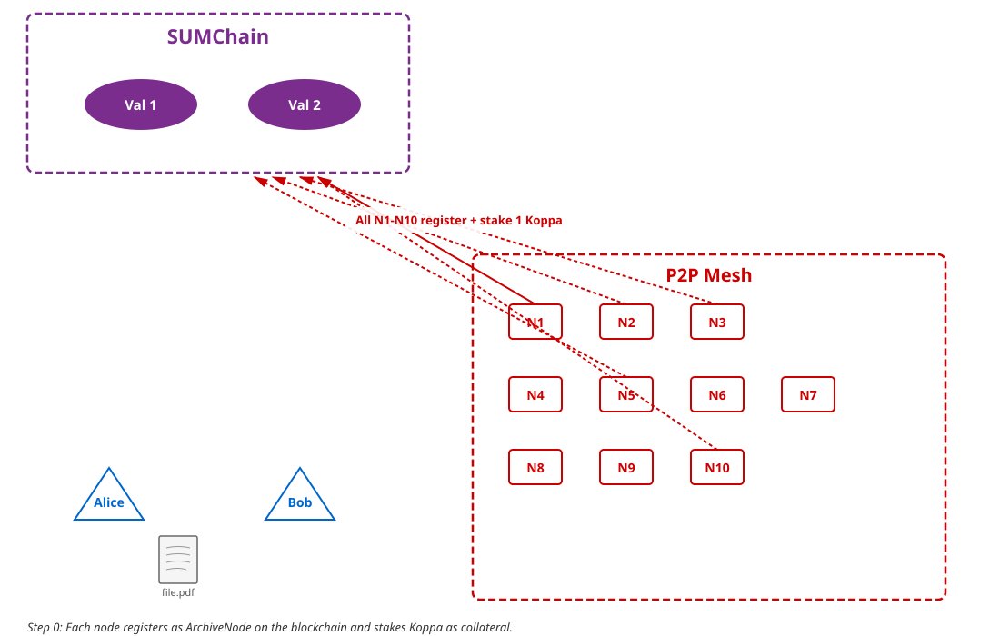
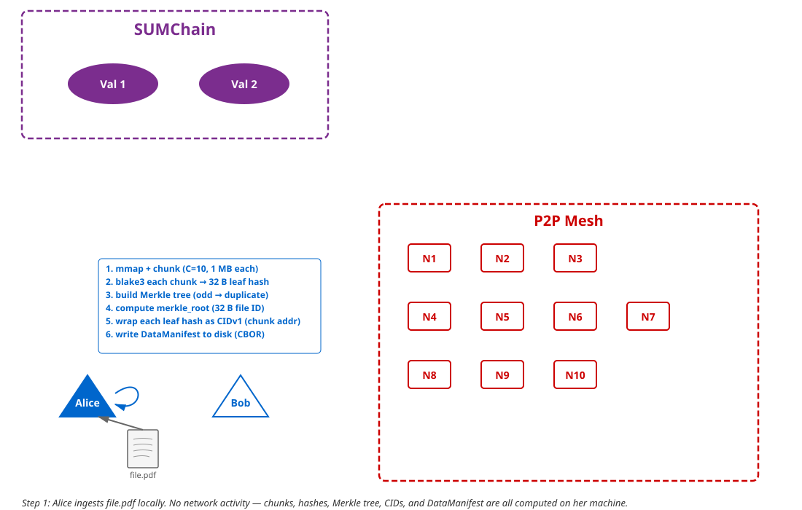
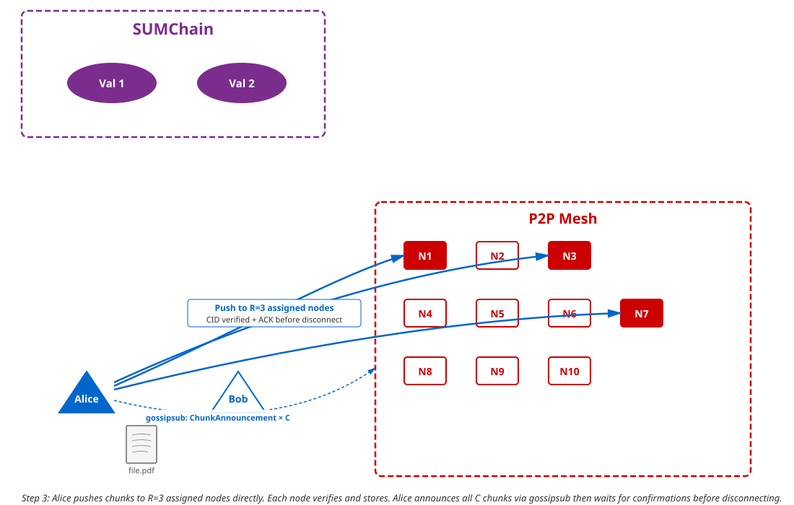
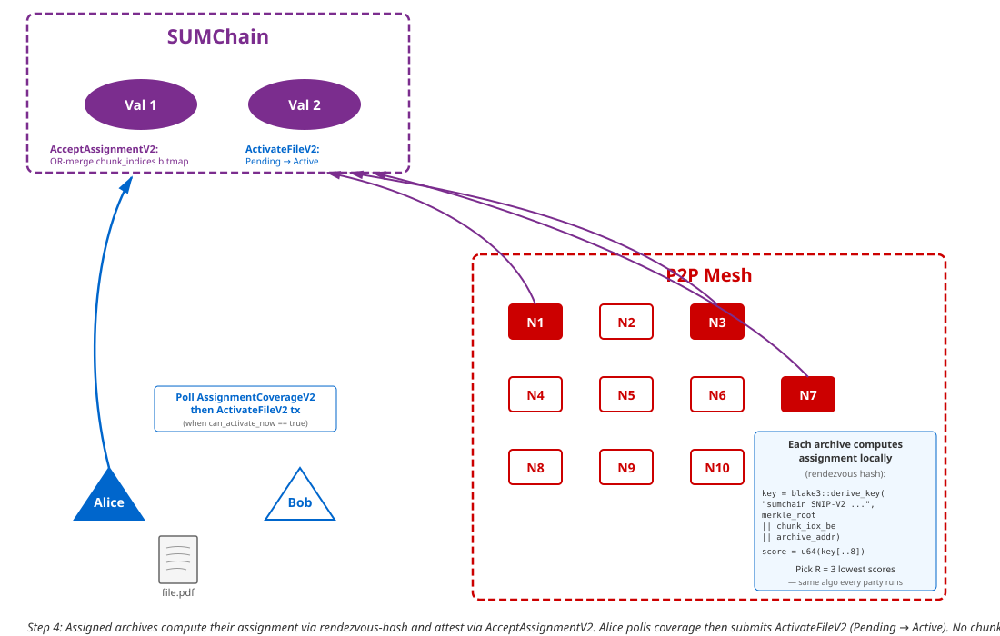
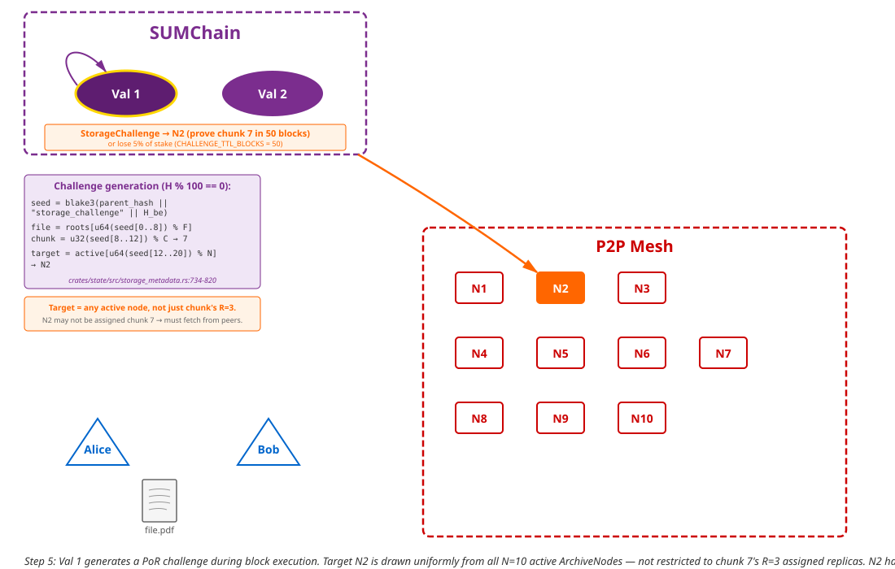

# File lifecycle: end-to-end walkthrough

This walkthrough follows a single file from its creation on a
client's disk to its verifiable retrieval by another user, using a
running fictional example (Alice uploads `file.pdf`; Bob later
downloads it). Each step names the SNIP-side function and the
chain-side check that anchors it, so a reader can trace the flow
through the code.

For the state-machine reference and V2-specific recovery paths
(`resume`, `abandon`, Private ingest, share / revoke / update-access)
see [`v2-state-machine.md`](v2-state-machine.md). For challenge
targeting and the shipped-vs-planned mechanisms upstream see
[`proof-of-retrievability.md`](proof-of-retrievability.md).

## The Complete SUM Chain Decentralized Storage Process

### The Actors

- **Val 1, Val 2** — Validator nodes running the SUM Chain blockchain. They maintain consensus, store metadata (never actual files), execute transactions, and issue Proof of Retrievability challenges. They are the "judges" of the network.
- **N1 through N10** — Storage nodes running the sum-storage-node daemon. They store actual file data on their hard drives, communicate with each other over a peer-to-peer (P2P) network, and talk to the validators via RPC (HTTP-based remote procedure calls). They are the "warehouse workers" of the network.
- **Alice** — A user (client) who wants to upload `file.pdf` to the network. Alice has a SUM Chain wallet with Koppa (the network's native currency) but does not run a storage node. She interacts with the network through a client application.
- **Bob** — A user who wants to download `file.pdf` later. Bob also has a SUM Chain wallet.

### The File

- `file.pdf` — 10,485,760 bytes (10 MB exactly)
- `C` = chunk count = `ceil(file_size / CHUNK_SIZE)` = `ceil(10,485,760 / 1,048,576)` = **10 chunks**
- `CHUNK_SIZE` = 1,048,576 bytes (1 MB) — a fixed constant, the same everywhere
- `R` = `REPLICATION_FACTOR` = 3 — each chunk is stored on 3 different nodes
- `N` = number of active storage nodes = 10

---

### Step 0 — Node Registration (one-time setup, each node does this independently)



Before any file storage can happen, each storage node must register itself on the blockchain. This is like applying for a license to participate in the storage market.

**What N1 does:**

1. N1 generates (or already has) an Ed25519 private key — a 32-byte secret number. This single key serves as both N1's blockchain wallet and its P2P network identity. From this key, two identities are derived:
   - **L1 Address** (20 bytes): `blake3(public_key)[12..32]` — how the blockchain identifies N1
   - **PeerId** (multihash of public key) — how other P2P nodes identify N1
   Both are derived from the same public key, so the blockchain can always map between them.

2. N1 creates a transaction: `TxPayload::NodeRegistry(Register { role: ArchiveNode })`. This says: "I want to be recognized as a storage node."

3. N1 must include a stake — a minimum of 1 Koppa locked as collateral. This stake exists as a financial threat: if N1 later fails to prove it holds data when challenged, the validators will destroy a percentage of this stake.

4. N1 signs the transaction with its Ed25519 private key (proving it controls this address) and broadcasts it to Val 1 or Val 2.

5. The validators execute the transaction:
   - Deduct the staked Koppa from N1's account balance
   - Write a `NodeRecord` to the blockchain's state database:
     ```
     {
       address: N1_address,
       role: ArchiveNode,
       staked_balance: 1,000,000,000 base units (1 Koppa),
       status: Active,
       registered_at: block 1000
     }
     ```

6. N1 starts the sum-storage-node daemon: `sum-node --key-file my_key.hex listen`. The daemon connects to the P2P mesh, begins discovering other nodes via mDNS, and starts its background workers (PorWorker, MarketSyncWorker).

**N2 through N10 each do the exact same process independently.** After all registrations, the blockchain's state database contains 10 `NodeRecord` entries, all with `status: Active`. Anyone can verify this by querying `storage_getActiveNodesAtHeight(height)` via RPC.

---

### Step 1 — Alice ingests file.pdf (local processing)



Alice wants to store `file.pdf` (10 MB) on the decentralized network. She runs a client tool (or uses a client library) that performs the following operations locally on her machine. No network activity happens yet.

**Chunking:**

The file is memory-mapped (a technique that lets the operating system read the file directly from disk without copying all 10 MB into RAM) and sliced into uniform `CHUNK_SIZE` (1 MB) pieces:

| Chunk Index | Byte Offset | Size (bytes) | Note |
|-------------|-------------|--------------|------|
| 0 | 0 | 1,048,576 | Full 1 MB |
| 1 | 1,048,576 | 1,048,576 | Full 1 MB |
| 2 | 2,097,152 | 1,048,576 | Full 1 MB |
| 3 | 3,145,728 | 1,048,576 | Full 1 MB |
| 4 | 4,194,304 | 1,048,576 | Full 1 MB |
| 5 | 5,242,880 | 1,048,576 | Full 1 MB |
| 6 | 6,291,456 | 1,048,576 | Full 1 MB |
| 7 | 7,340,032 | 1,048,576 | Full 1 MB |
| 8 | 8,388,608 | 1,048,576 | Full 1 MB |
| 9 | 9,437,184 | 1,048,576 | Full 1 MB |

In this example, the file is exactly 10 MB, so all 10 chunks are full-sized. If the file were 10.5 MB, there would be 11 chunks — the last one would be 524,288 bytes (0.5 MB). The formula is: `C = ceil(file_size / CHUNK_SIZE)`.

**Hashing each chunk:**

Each chunk's raw bytes are hashed using BLAKE3, a cryptographic hash function that produces a 32-byte (256-bit) fingerprint. BLAKE3 is deterministic: the same input always produces the same output, and changing even one bit of input produces a completely different output.

```
H(0) = blake3(chunk_0_bytes) -> 32 bytes
H(1) = blake3(chunk_1_bytes) -> 32 bytes
...
H(9) = blake3(chunk_9_bytes) -> 32 bytes
```

**Merkle tree construction:**

The `C` = 10 chunk hashes become the **leaf nodes** of a binary Merkle tree. The tree is built bottom-up by repeatedly pairing adjacent hashes, concatenating them, and hashing the concatenation:

```
Level 0 (leaves):   H(0)  H(1)  H(2)  H(3)  H(4)  H(5)  H(6)  H(7)  H(8)  H(9)
                      \   /       \   /       \   /       \   /       \   /
Level 1:            H(0,1)      H(2,3)      H(4,5)      H(6,7)      H(8,9)
                       \         /              \         /              |
Level 2:           H(0,1,2,3)              H(4,5,6,7)              H(8,9,8,9)*
                          \                   /                       /
Level 3:            H(0-3, 4-7)                          H(8,9,8,9)
                              \                         /
Level 4 (root):              merkle_root
```

*When a level has an odd number of nodes, the last node is **duplicated** (hashed with itself). This is a critical detail — the L1 validators use this same rule, so both sides must agree.*

The final output is the **merkle_root** — a single 32-byte hash that uniquely represents the entire file. Example: `34a749797e853c5f3c6a678b881adee2103c66611f999082efff71bb75701b66`. If any byte in any chunk changes, the merkle_root changes.

**CID generation:**

Each chunk hash is also converted into a **CID** (Content Identifier) — a self-describing string that encodes the hash algorithm used and the hash value:
```
CID = base32lower( CIDv1_header + multihash(BLAKE3, chunk_hash) )
-> "bafkr4iblchqzqis3tr73bre2atjte5bzbifrleynael4j4vvoyreohcfge"
```

The CID serves as the chunk's address on the network and its filename on disk. Crucially, the merkle_root identifies the *file*, while each CID identifies a single *chunk*. One file has one merkle_root but `C` CIDs.

**DataManifest:**

All of this information is bundled into a `DataManifest`:
```
{
  file_name: "file.pdf",
  file_hash: blake3(entire_file),      // 32 bytes
  total_size_bytes: 10,485,760,        // 10 MB
  chunk_count: 10,                     // C = 10
  merkle_root: [34, a7, 49, ...],      // 32 bytes — the file's identity
  chunks: [
    { chunk_index: 0, offset: 0,         size: 1048576, blake3_hash: [...], cid: "bafkr4i..." },
    { chunk_index: 1, offset: 1048576,   size: 1048576, blake3_hash: [...], cid: "bafkr4ie..." },
    ... (8 more entries)
  ]
}
```

This manifest is serialized to disk as a CBOR file (a compact binary format, like JSON but smaller and binary-native).

---

### Step 2 — Alice registers the file on the blockchain


Alice now needs the blockchain to officially recognize this file. She creates and signs a `RegisterFilePendingV2` transaction ([crates/sum-node/src/tx_builder.rs:115-147](../../crates/sum-node/src/tx_builder.rs#L115-L147)) containing:

- `merkle_root`: `34a749...` — the file's unique identity (32 bytes)
- `plaintext_size_bytes`: 10,485,760
- `chunk_count`: 10
- `visibility`: `Public` (or `Private` — see the V2 Lifecycle section below for the encrypted-file flow)
- `initial_access`: `[]` for a Public file; for Private, one `AccessEntryV2` per recipient carrying an 80-byte encrypted key bundle ([crates/sum-types/src/rpc_types.rs:122-131](../../crates/sum-types/src/rpc_types.rs#L122-L131)). The transaction variant names this field `initial_access` ([sum-chain `crates/primitives/src/storage_metadata.rs:208`](https://github.com/SUM-INNOVATION/sum-chain/blob/main/crates/primitives/src/storage_metadata.rs#L208)); the executor persists it under `StorageMetadataV2.access_list` ([sum-chain `crates/primitives/src/storage_metadata.rs:609`](https://github.com/SUM-INNOVATION/sum-chain/blob/main/crates/primitives/src/storage_metadata.rs#L609)) — same content, different field name on the input vs. the state.
- `fee_deposit`: 100 Koppa — money locked to pay storage nodes over time. This is the economic fuel that keeps nodes motivated to store the file. When the fee pool runs out, nodes are no longer rewarded for storing it.

Alice signs this transaction with her Ed25519 private key, broadcasts it via JSON-RPC `send_raw_transaction`, and waits for `Finalized` ([crates/sum-node/src/tx_wait.rs:88-132](../../crates/sum-node/src/tx_wait.rs#L88-L132)).

The validators execute the transaction:
- Verify Alice's signature
- Deduct 100 Koppa from Alice's account as the fee deposit
- Write a `StorageMetadataV2` entry to the blockchain's state database ([sum-chain `crates/primitives/src/storage_metadata.rs:587-612`](https://github.com/SUM-INNOVATION/sum-chain/blob/main/crates/primitives/src/storage_metadata.rs#L587-L612); the RPC-wire mirror that clients query is `StorageFileInfoV2` at [crates/sum-types/src/rpc_types.rs:134-176](../../crates/sum-types/src/rpc_types.rs#L134-L176)):
  ```
  {
    merkle_root: 34a749...,
    owner: Alice_address,
    plaintext_size_bytes: 10,485,760,
    stored_size_bytes:    10,485,760,   // = plaintext for Public; plaintext + 16×chunk_count for Private
    chunk_count: 10,
    visibility: Public,
    lifecycle:  Pending,                 // becomes Active after ActivateFileV2
    access_list: [],
    fee_pool: 100,000,000,000 base units (100 Koppa),
    created_at: block 5000,
    assignment_height: 5000              // chain captures this snapshot for deterministic chunk assignment
  }
  ```

**The file now officially exists on the blockchain — but only as metadata, and only in `Pending` state.** The blockchain stores 32 bytes of merkle_root plus the rules (visibility, access list, fee pool). No actual PDF data touches the chain. The file becomes downloadable after Alice pushes chunks (Step 3), archives attest coverage (Step 4), and Alice submits `ActivateFileV2` to transition Pending → Active.

---

### Step 3 — Alice pushes chunks to the P2P mesh



Alice runs:
```bash
sum-node --client --key-file alice.hex --rpc-url http://<validator>:9944 ingest-v2 file.pdf
```

Her client connects to the P2P mesh and discovers nearby storage nodes via mDNS (multicast DNS — nodes broadcast "I'm here" on the local network). Alice does not need to register as an ArchiveNode, stake Koppa, or run storage infrastructure — she is an external user of the network.

Alice does **not** push to a single node. Instead, she runs the V2 deterministic assignment algorithm described in Step 4 — she queries the L1 for the active-node snapshot at `assignment_height` (`storage_getActiveNodesAtHeight`, [crates/sum-node/src/rpc_client.rs:228-234](../../crates/sum-node/src/rpc_client.rs#L228-L234)) and computes the top-`R` = 3 archives per chunk via `chunks_for_archive_v2` ([crates/sum-store/src/assignment_v2.rs:151-178](../../crates/sum-store/src/assignment_v2.rs#L151-L178)). She then pushes each chunk directly to its 3 assigned archives in parallel using the `/sum/storage/v2` push protocol over QUIC (a fast, encrypted transport protocol).

Each V2 push carries the chunk bytes alongside an inline Merkle proof — `ShardRequestV2::Push { data, merkle_root, chunk_index, merkle_path }` ([crates/sum-net/src/codec.rs:176-207](../../crates/sum-net/src/codec.rs#L176-L207)). The receiving node validates four things via `PushValidator::validate_push` ([crates/sum-node/src/push_validator.rs:255](../../crates/sum-node/src/push_validator.rs#L255)) **before** writing anything to disk:

1. The file is registered on chain and not Abandoned (`storage_getFileInfoV2`)
2. `chunk_index < chunk_count`
3. The receiving archive is in the snapshot AND is one of the V2-assigned archives for this `chunk_index`
4. `verify_merkle_proof_bytes_for_tree(blake3(data), chunk_index, merkle_path, merkle_root, chunk_count)` succeeds ([crates/sum-store/src/verify.rs:72-95](../../crates/sum-store/src/verify.rs#L72-L95))

Only after all four checks pass does the node write the chunk to its local disk as `<cid>.chunk` ([crates/sum-store/src/store.rs:39-43](../../crates/sum-store/src/store.rs#L39-L43)) and respond with `PushAck`. The wire CID is never trusted — the leaf hash is derived from `data` itself.

After Alice's pushes complete, she also sends the `DataManifest` to each distinct assigned archive via `ManifestPushV2` ([crates/sum-net/src/lib.rs:249-265](../../crates/sum-net/src/lib.rs#L249-L265), variant defined at [crates/sum-net/src/codec.rs:201](../../crates/sum-net/src/codec.rs#L201)). The receiver recomputes the merkle root from the manifest's chunk descriptors and rejects on mismatch ([crates/sum-store/src/serve.rs:418-488](../../crates/sum-store/src/serve.rs#L418-L488)). Alice then publishes one `ChunkAnnouncement` per chunk — `C` total — on the `sum/storage/v1` Gossipsub topic ([crates/sum-store/src/announce.rs:11-20](../../crates/sum-store/src/announce.rs#L11-L20)) so other peers can discover the CIDs. Each announcement contains:

- `merkle_root`: `34a749...` — which file this chunk belongs to
- `chunk_index`: 0 through 9 — which piece
- `chunk_cid`: the content address for requesting this specific chunk
- `size_bytes`: 1,048,576 bytes (or less for a final partial chunk)

**Alice waits for confirmation before disconnecting.** She tracks `PushAck` responses from each target archive. Only after every assigned archive has accepted each of its chunks (or the wall-clock timeout `--push-wait-secs` elapses, default 120 s — [crates/sum-node/src/main.rs:172-173](../../crates/sum-node/src/main.rs#L172-L173)) does she move on to Step 4's coverage poll.

---

### Step 4 — Storage nodes determine their assignments and fetch chunks



Each storage node independently runs the **V2 deterministic assignment algorithm** that Alice already ran in Step 3 to choose her push targets. The goal: for each of the `C` = 10 chunks, determine which `R` = 3 of the `N` = 10 nodes should store a copy. No central coordinator decides this — every participant (Alice, every archive, the L1 validators) computes the same answer independently because they all use the same public on-chain inputs.

Each archive queries the L1 for the snapshot pinned at the file's `assignment_height` and reads chain params for `R`:

1. `storage_getActiveNodesAtHeight(assignment_height)` ([crates/sum-node/src/rpc_client.rs:228-234](../../crates/sum-node/src/rpc_client.rs#L228-L234)) -> "What storage nodes were active when this file was registered?" -> Returns 10 addresses: `[N1_addr, ..., N10_addr]`, canonicalized via `BTreeSet` (deduped + sorted by address bytes — every participant sorts identically).
2. `chain_getChainParams()` ([crates/sum-types/src/rpc_types.rs:213-258](../../crates/sum-types/src/rpc_types.rs#L213-L258)) -> reads `assignment_replication_factor` (default 3).

**The algorithm** (rendezvous hash, [crates/sum-store/src/assignment_v2.rs:52-112](../../crates/sum-store/src/assignment_v2.rs#L52-L112)):

For each `(chunk_index, archive)` pair, compute a score:

```
Step A: Domain-separation context (exact bytes — consensus-critical):
   context = "sumchain SNIP-V2 chunk-assignment v1"

Step B: Derive a 32-byte key:
   key = blake3::derive_key(context, merkle_root || chunk_index_be || archive_l1_address)

Step C: Convert to a 64-bit score:
   score = u64::from_be_bytes(key[..8])

Step D: Select the R archives with the lowest scores for this chunk.
   Tie-break: ascending by archive L1 address (canonical sort of the snapshot).
```

The context string, big-endian byte order, `blake3::derive_key` variant, and tie-break rule MUST match the L1's validation exactly. Any divergence breaks chain conformance.

**Example result** (the actual assignment depends on the rendezvous-hash scores, but this illustrates the pattern):

| Chunk | Replica 0 | Replica 1 | Replica 2 | Nodes NOT assigned |
|-------|-----------|-----------|-----------|-------------------|
| 0 | N3 | N7 | N1 | N2, N4, N5, N6, N8, N9, N10 |
| 1 | N5 | N2 | N9 | N1, N3, N4, N6, N7, N8, N10 |
| 2 | N1 | N10 | N4 | N2, N3, N5, N6, N7, N8, N9 |
| 3 | N8 | N3 | N6 | N1, N2, N4, N5, N7, N9, N10 |
| 4 | N2 | N6 | N10 | N1, N3, N4, N5, N7, N8, N9 |
| 5 | N7 | N1 | N5 | N2, N3, N4, N6, N8, N9, N10 |
| 6 | N4 | N9 | N2 | N1, N3, N5, N6, N7, N8, N10 |
| 7 | N10 | N5 | N8 | N1, N2, N3, N4, N6, N7, N9 |
| 8 | N6 | N4 | N3 | N1, N2, N5, N7, N8, N9, N10 |
| 9 | N9 | N8 | N7 | N1, N2, N3, N4, N5, N6, N10 |

In this example, each node stores approximately 3 chunks (30 total assignments across 10 nodes = ~3 per node), not all 10. With `R` = 3 and `N` = 10, storage overhead is 3x (30 chunk-copies for 10 original chunks), but each individual node only uses ~30% of the disk space that full replication would require.

**What N5 does (as an example):**

1. N5 calls `chunks_for_archive_v2(merkle_root, chunk_count, snapshot, R, my_addr)` ([crates/sum-store/src/assignment_v2.rs:151-178](../../crates/sum-store/src/assignment_v2.rs#L151-L178)) and gets the `BTreeSet` of chunk indices it owns -> chunks 1, 5, 7.
2. N5 checks its local disk: it already has chunks 1, 5, 7 — Alice's V2 pushes from Step 3 each carried a Merkle proof that N5's `PushValidator` already verified before writing.
3. N5 attests on chain by submitting `AcceptAssignmentV2` ([crates/sum-node/src/tx_builder.rs:190-205](../../crates/sum-node/src/tx_builder.rs#L190-L205), driven by [crates/sum-node/src/assignment_attestor.rs](../../crates/sum-node/src/assignment_attestor.rs)) carrying `chunk_indices: [1, 5, 7]`. The chain OR-merges those bits into N5's per-`(file, archive)` bitmap. Files whose per-archive assignment exceeds `max_chunk_indices_per_tx` (default 65,536 — [crates/sum-types/src/rpc_types.rs:228-231](../../crates/sum-types/src/rpc_types.rs#L228-L231)) split across multiple OR-merge txs that compose into the same bitmap.

Attestation runs as a `tokio::spawn`'d task from the V2 inbound dispatcher's manifest-push handler ([crates/sum-node/src/inbound_v2.rs](../../crates/sum-node/src/inbound_v2.rs)) so inbound request latency is decoupled from chain finality.

**All assigned archives perform this process independently.** Alice polls `storage_getAssignmentCoverageV2` ([crates/sum-node/src/rpc_client.rs:279-290](../../crates/sum-node/src/rpc_client.rs#L279-L290)) until `can_activate_now == true` (every chunk has at least one currently-`Active` accepting archive), then submits `ActivateFileV2` ([crates/sum-node/src/tx_builder.rs:150-161](../../crates/sum-node/src/tx_builder.rs#L150-L161)). On finalization the file transitions Pending → Active and PoR challenges become eligible after `activated_at_height + activation_grace_blocks`.

For V2 files there is no MarketSync-driven re-fetch loop — chain-side PoR challenges plus slashing (Steps 5–7) enforce retention. The `MarketSyncWorker` background task ([crates/sum-node/src/market_sync.rs:30](../../crates/sum-node/src/market_sync.rs#L30), spawned from `run_listen` at [crates/sum-node/src/main.rs:661](../../crates/sum-node/src/main.rs#L661)) remains alive as a V1-legacy compatibility worker that polls `storage_getFundedFiles` + `storage_getActiveNodes` and self-heals V1-registered files via the older hash + linear-probe algorithm in [crates/sum-store/src/assignment.rs](../../crates/sum-store/src/assignment.rs); it does not drive V2 retention.

After Step 4 completes, every chunk of file.pdf is held by its `R` = 3 deterministically-assigned archives, attested on chain, and the file is downloadable.

---

### Step 5 — Validators issue Proof of Retrievability (PoR) challenges



> **Authoritative source.** The chain-side challenge mechanism has
> evolved since this walkthrough was first written. The current-day
> description — including how the `assignment_targeting` chain
> parameter governs which archives can be challenged for which
> chunks, the distinction between shipped V2 assignment-aware
> targeting (upstream `sum-chain` issue #97) and the planned
> bounded coverage scheduler (upstream `sum-chain` issue #81), and
> the SNIP-side responder path — lives in
> [`proof-of-retrievability.md`](proof-of-retrievability.md). The
> paragraphs below summarize one challenge cycle for narrative
> continuity; treat `proof-of-retrievability.md` as the source of
> truth for the eligibility rules.

Every `CHALLENGE_INTERVAL_BLOCKS` = 100 blocks, the validators
automatically generate a storage challenge during block execution.
No extrinsic, no human trigger — `execute_block` calls
`generate_challenge` when `height % CHALLENGE_INTERVAL_BLOCKS == 0`.
Chain-side symbols are cited by name rather than by line range so
minor source movement in `sum-chain` does not silently break the
reference.

**How a challenge is generated (block height `H`, with `H % 100 == 0`):**

1. **Filter to eligible files and archives.**
   - `active_nodes` = every `ArchiveNode` with `status == Active`. For our example, `N` = 10.
   - `eligible_roots` = V1 files whose `fee_pool > 0`, plus V2 files
     for which `funded_active_v2_candidates()` reports at least one
     currently-`Active` accepting archive.
   If either set is empty, no challenge is issued at this height.

2. **Seed generation.**
   ```
   seed = blake3(parent_hash || "storage_challenge" || height.to_be_bytes())
   ```
   The seed is a 32-byte BLAKE3 digest. Deterministic — every
   validator computes the same value. Unpredictable — no one can
   compute it before the parent block is finalized.

3. **Select the file.**
   ```
   file_index = u64::from_be_bytes(seed[0..8]) % eligible_roots.len()
   ```

4. **Select the chunk.**
   ```
   chunk_index = u32::from_be_bytes(seed[8..12]) % chunk_count
   ```
   Suppose this yields chunk 7.

5. **Select the target archive.** The eligibility set depends on
   the chain-side `assignment_targeting` gate. The gate value must
   be verified at runtime via `chain_getChainParams` — SNIP
   documentation does not restate the current mainnet value as a
   constant.

   - **`assignment_targeting` enabled (V2, upstream `sum-chain`
     issue #97).** The target is drawn from the chunk's
     assigned-active archive set — the same rendezvous-hash output
     described in Step 4. Unassigned archives are not challenged
     for this chunk.
   - **`assignment_targeting` disabled, or V1 legacy path.** The
     target is drawn uniformly from `active_nodes` regardless of
     assignment. An archive may be asked to prove a chunk it was
     never assigned to hold.

   See [`proof-of-retrievability.md`](proof-of-retrievability.md)
   for the full eligibility rules and for how the two mechanisms
   (assignment-aware targeting and the planned bounded coverage
   scheduler) interact — they are separate axes of the design.

6. **Write the challenge to state:**
   ```
   StorageChallenge {
     challenge_id:      blake3(merkle_root || chunk_index.to_be_bytes() || height.to_be_bytes()),
     merkle_root:       34a749...,
     chunk_index:       7,
     target_node:       <chosen archive address>,
     created_at_height: H,        // e.g. 5100
     expires_at_height: H + 50,   // CHALLENGE_TTL_BLOCKS = 50
   }
   ```

**Consequences for `target_node`:**

- The target has 50 blocks to submit a `SubmitStorageProof`
  transaction carrying the chunk hash plus a Merkle path that
  verifies against `merkle_root`. The chain checks
  `challenge.target_node == sender`,
  `current_height <= challenge.expires_at_height`, and that the
  Merkle proof reconstructs `merkle_root`. Any submitter equal to
  `target_node` whose proof verifies clears the challenge and
  earns the payout from the file's `fee_pool`.
- If 50 blocks elapse with no valid proof,
  `process_expired_challenges` slashes `SLASH_PERCENTAGE` = 5% of
  the archive's `staked_balance` and flips its `NodeStatus` to
  `Slashed`.

**Implication for operators.** Provision the archive against the
current gate state on the target chain, and verify that state at
runtime:

- **`assignment_targeting` enabled.** The archive is only
  challenged for chunks it was deterministically assigned to hold.
  Disk provisioning tracks the assignment output for the
  archive's L1 address.
- **`assignment_targeting` disabled, or V1 legacy path.** The
  archive may be asked to prove any chunk of any funded file.
  Fetching an unassigned chunk from a peer within
  `CHALLENGE_TTL_BLOCKS` (via the `ChunkAnnouncement` gossip from
  Step 3 or the V2 pull helpers) becomes load-bearing.

See [`proof-of-retrievability.md`](proof-of-retrievability.md) for
the responder side ([`PorWorker`](../../crates/sum-node/src/por_worker.rs))
and for how the pinned chain commit in
[`../reference/chain-compat.md`](../reference/chain-compat.md)
serves as the load-bearing reference for gate state.

---

### Step 6 — N2 responds with a cryptographic proof


N2's **PorWorker** ([crates/sum-node/src/por_worker.rs:24-36](../../crates/sum-node/src/por_worker.rs#L24-L36); spawned from [crates/sum-node/src/main.rs:651-658](../../crates/sum-node/src/main.rs#L651-L658)) polls the blockchain every few seconds: `storage_getActiveChallenges(my_address)` ([crates/sum-node/src/rpc_client.rs:96-102](../../crates/sum-node/src/rpc_client.rs#L96-L102)). It sees the challenge targeting it for chunk 7 of file `34a749...`.

N2 must now prove it holds chunk 7 without sending the entire 1 MB chunk on-chain (that would be far too expensive — blockchains are for small data, not megabytes). Instead, it constructs a **Merkle proof**: a compact set of sibling hashes that lets the validator mathematically verify that chunk 7 belongs to this file.

**What N2 does:**

1. **Read the chunk from disk:** N2 reads the file `<chunk_7_cid>.chunk` from its local store — 1,048,576 bytes ([crates/sum-node/src/por_worker.rs:175-187](../../crates/sum-node/src/por_worker.rs#L175-L187)).

2. **Hash the chunk:** `chunk_hash = blake3(chunk_7_bytes)` -> 32 bytes ([crates/sum-node/src/por_worker.rs:190](../../crates/sum-node/src/por_worker.rs#L190)). This proves "I have data whose hash is this value."

3. **Load the DataManifest** for file `34a749...` from the manifest index ([crates/sum-node/src/por_worker.rs:168-173](../../crates/sum-node/src/por_worker.rs#L168-L173)). The manifest contains all 10 chunk hashes.

4. **Rebuild the Merkle tree** from the 10 stored chunk hashes ([crates/sum-node/src/por_worker.rs:193-198](../../crates/sum-node/src/por_worker.rs#L193-L198)) — not the chunk data, just the 32-byte hashes that are in the manifest.

5. **Generate the Merkle proof:** Call `generate_proof(chunk_index = 7)` ([crates/sum-store/src/merkle.rs:89-115](../../crates/sum-store/src/merkle.rs#L89-L115); invoked at [crates/sum-node/src/por_worker.rs:199](../../crates/sum-node/src/por_worker.rs#L199)). This walks from chunk 7's leaf up to the root, collecting the **sibling hash** at each level — the minimum information needed to reconstruct the path to the root:
   ```
   Proof for chunk 7 (index 7, binary = 0111):

   Level 0: Chunk 7's sibling is chunk 6    -> proof[0] = H(6)
   Level 1: Parent(6,7)'s sibling is Parent(4,5) -> proof[1] = H(4,5)
   Level 2: Parent(4-7)'s sibling is Parent(0-3) -> proof[2] = H(0,1,2,3)
   Level 3: Parent(0-7)'s sibling is Parent(8-9) -> proof[3] = H(8,9,8,9)

   merkle_path = [H(6), H(4,5), H(0-3), H(8-9,8-9)]  <-- 4 hashes = 128 bytes
   ```

   This is much smaller than sending the 1 MB chunk. The proof is `O(log2(C))` hashes — for 10 chunks, that's 4 hashes (128 bytes).

6. **Build the transaction:** The `SubmitStorageProof` operation is the inner enum variant — defined chain-side at [sum-chain `crates/primitives/src/storage_metadata.rs:102-113`](https://github.com/SUM-INNOVATION/sum-chain/blob/main/crates/primitives/src/storage_metadata.rs#L102-L113). It is wrapped in `StorageMetadataTxData` ([sum-chain `crates/primitives/src/storage_metadata.rs:118-120`](https://github.com/SUM-INNOVATION/sum-chain/blob/main/crates/primitives/src/storage_metadata.rs#L118-L120)) and carried by `TxPayload::StorageMetadata(...)` ([sum-chain `crates/primitives/src/transaction.rs:392`](https://github.com/SUM-INNOVATION/sum-chain/blob/main/crates/primitives/src/transaction.rs#L392)). The SNIP-side mirror that builds this is at [crates/sum-node/src/tx_builder.rs:453-459](../../crates/sum-node/src/tx_builder.rs#L453-L459):
   ```
   TxPayload::StorageMetadata(StorageMetadataTxData {
       operation: StorageMetadataOperation::SubmitStorageProof {
           challenge_id: <from the challenge>,
           merkle_root:  34a749...,
           chunk_index:  7,
           chunk_hash:   <32 bytes>,
           merkle_path:  [<32 bytes>, <32 bytes>, <32 bytes>, <32 bytes>],
       },
   })
   ```

7. **Serialize, sign, and broadcast:** N2 serializes the transaction in the exact binary format the L1 expects — **bincode v1** (`bincode = "1.3"` in both `Cargo.toml`s; called as `bincode1::serialize` at [crates/sum-node/src/tx_builder.rs:336](../../crates/sum-node/src/tx_builder.rs#L336)) — hashes the serialized bytes with blake3, signs the hash with its Ed25519 private key, and broadcasts the signed transaction to the validators ([crates/sum-node/src/tx_builder.rs:335-340](../../crates/sum-node/src/tx_builder.rs#L335-L340)).

---

### Step 7 — Validators verify the proof and settle payment


Val 1 receives N2's `SubmitStorageProof` transaction in the mempool and includes it in the next block. During block execution the chain runs `execute_submit_proof` ([sum-chain `crates/state/src/storage_metadata.rs:623-696`](https://github.com/SUM-INNOVATION/sum-chain/blob/main/crates/state/src/storage_metadata.rs#L623-L696)):

1. **Validate the challenge exists** in the state database and that N2 is the target node — `challenge.target_node == *sender` ([sum-chain `crates/state/src/storage_metadata.rs:641`](https://github.com/SUM-INNOVATION/sum-chain/blob/main/crates/state/src/storage_metadata.rs#L641)).

2. **Check expiry:** current block height must be ≤ `expires_at_height` (= `H + 50`). If the block is `H + 51` or later, the proof is too late ([sum-chain `crates/state/src/storage_metadata.rs:648`](https://github.com/SUM-INNOVATION/sum-chain/blob/main/crates/state/src/storage_metadata.rs#L648)).

3. **Verify the Merkle proof** — reconstruct the path from the chunk hash to the root using the sibling hashes. The chain's verifier lives at [sum-chain `crates/state/src/storage_metadata.rs:174`](https://github.com/SUM-INNOVATION/sum-chain/blob/main/crates/state/src/storage_metadata.rs#L174) and is invoked from `execute_submit_proof` at [`storage_metadata.rs:692`](https://github.com/SUM-INNOVATION/sum-chain/blob/main/crates/state/src/storage_metadata.rs#L692):
   ```
   Start: current = chunk_hash

   Level 0: chunk_index=7, binary=0111, bit 0 is 1 -> current is RIGHT child
            current = blake3(proof[0] + current)        // H(6) + H(7)

   Level 1: index 3 (7/2=3), bit 1 is 1 -> current is RIGHT child
            current = blake3(proof[1] + current)        // H(4,5) + H(6,7)

   Level 2: index 1 (3/2=1), bit 2 is 0 -> current is LEFT child
            current = blake3(current + proof[2])        // H(0-3) + H(4-7)

   Level 3: index 0 (1/2=0), bit 3 is 0 -> current is LEFT child
            current = blake3(current + proof[3])        // H(0-7) + H(8-9)

   Final check: does current == merkle_root stored on-chain (34a749...)? -> YES
   ```

   The bit-checking rule `(chunk_index >> level) & 1` ([sum-chain `crates/state/src/storage_metadata.rs:186-193`](https://github.com/SUM-INNOVATION/sum-chain/blob/main/crates/state/src/storage_metadata.rs#L186-L193)) determines whether the current hash is the left or right child at each level. This must match exactly between the storage node's proof generation and the validator's verification — one bug here and every proof fails.

4. **Verify proof length:** the number of sibling hashes must equal `ceil(log2(C))` ([sum-chain `crates/state/src/storage_metadata.rs:677-682`](https://github.com/SUM-INNOVATION/sum-chain/blob/main/crates/state/src/storage_metadata.rs#L677-L682)). For `C` = 10, that's 4. Too few or too many → reject.

5. **Settlement (proof valid)** ([sum-chain `crates/state/src/storage_metadata.rs:698-715`](https://github.com/SUM-INNOVATION/sum-chain/blob/main/crates/state/src/storage_metadata.rs#L698-L715)):
   - Transfer `CHALLENGE_REWARD` = 10 Koppa (= `10_000_000_000` base units, [sum-chain `crates/primitives/src/storage_metadata.rs:24`](https://github.com/SUM-INNOVATION/sum-chain/blob/main/crates/primitives/src/storage_metadata.rs#L24)) from the file's `fee_pool` to N2's account
   - `fee_pool` decreases: 100 Koppa → 90 Koppa ([`storage_metadata.rs:706`](https://github.com/SUM-INNOVATION/sum-chain/blob/main/crates/state/src/storage_metadata.rs#L706); credit at [`storage_metadata.rs:710`](https://github.com/SUM-INNOVATION/sum-chain/blob/main/crates/state/src/storage_metadata.rs#L710))
   - Delete the challenge from the state database ([`storage_metadata.rs:715`](https://github.com/SUM-INNOVATION/sum-chain/blob/main/crates/state/src/storage_metadata.rs#L715))
   - N2's stake remains untouched

6. **Settlement (proof missing — what happens if N2 never responds):**
   If block `H + 51` arrives and no valid proof has been submitted:
   - The validator's `process_expired_challenges()` ([sum-chain `crates/state/src/executor.rs:2245-2308`](https://github.com/SUM-INNOVATION/sum-chain/blob/main/crates/state/src/executor.rs#L2245-L2308)) runs at the **start** of the block, before any user transactions ([sum-chain `crates/state/src/executor.rs:2143-2148`](https://github.com/SUM-INNOVATION/sum-chain/blob/main/crates/state/src/executor.rs#L2143-L2148) — the in-source comment is explicit: *"Slash expired challenges BEFORE user transactions … prevents a node from front-running a slash by submitting a last-second proof and a withdrawal in the same block"*)
   - `SLASH_PERCENTAGE` = 5% of N2's `staked_balance` is destroyed ([sum-chain `crates/state/src/executor.rs:2263-2268`](https://github.com/SUM-INNOVATION/sum-chain/blob/main/crates/state/src/executor.rs#L2263-L2268); constant at [sum-chain `crates/primitives/src/storage_metadata.rs:27`](https://github.com/SUM-INNOVATION/sum-chain/blob/main/crates/primitives/src/storage_metadata.rs#L27))
   - N2's `NodeStatus` is set to `Slashed` ([sum-chain `crates/state/src/executor.rs:2269`](https://github.com/SUM-INNOVATION/sum-chain/blob/main/crates/state/src/executor.rs#L2269)) — it is no longer considered an active node
   - The challenge is deleted ([sum-chain `crates/state/src/executor.rs:2307`](https://github.com/SUM-INNOVATION/sum-chain/blob/main/crates/state/src/executor.rs#L2307))
   - N2 receives nothing from the fee pool

This cycle repeats continuously — every 100 blocks, a new random challenge targets a random chunk on a random **active** ArchiveNode (uniform over all active archives; not restricted to the chunk's assigned replicas — see Step 5). Over time, honest nodes that actually store their assigned data accumulate Koppa. Nodes that cheat (claim to store data but don't) get repeatedly slashed until their stake is depleted and they are ejected from the network.

---

### Step 8 — Bob downloads file.pdf


Bob knows the file's `merkle_root` (`34a749...`) — Alice shared it with him. The merkle_root is the file's permanent address on the SUM network. Bob wants to reconstruct the original file.pdf.

Bob runs:
```bash
sum-node download 34a749797e853c5f3c6a678b881adee2103c66611f999082efff71bb75701b66 --output ./file.pdf
```

The `Download` subcommand ([crates/sum-node/src/main.rs:206-218](../../crates/sum-node/src/main.rs#L206-L218)) handles the entire retrieval pipeline automatically:

**Step 8a — Route the download:**

Before fetching anything, Bob's client calls `storage_getFileInfoV2(34a749...)` ([crates/sum-node/src/rpc_client.rs:209-220](../../crates/sum-node/src/rpc_client.rs#L209-L220)) to read the file's chain row — `visibility`, `lifecycle`, `assignment_height`, `chunk_count`, and the paginated access list. The pure router `route_download_target` ([crates/sum-node/src/download_route.rs:63-72](../../crates/sum-node/src/download_route.rs#L63-L72)) dispatches to one of three pipelines: `V1Legacy`, `V2Public`, or `V2Private` (fail-closed on unknown visibility via `RouteError::UnknownV2Visibility` at [download_route.rs:69-71](../../crates/sum-node/src/download_route.rs#L69-L71)). Since Alice registered file.pdf via `RegisterFilePendingV2` with `visibility = Public`, Bob takes the `V2Public` path. (The `V2Private` path is covered in the V2 Lifecycle section below.)

**Step 8b — Get the manifest:**

Bob's client builds a `V2AssignmentView` ([crates/sum-node/src/download_v2_routing.rs:92-151](../../crates/sum-node/src/download_v2_routing.rs#L92-L151)) — it fetches the same snapshot Alice used (`storage_getActiveNodesAtHeight(assignment_height)`), runs the same V2 rendezvous-hash algorithm from Step 4, and produces a `distinct_assigned` set of archives plus a per-chunk archive list.

Bob then fans out `ManifestPullV2` ([crates/sum-net/src/lib.rs:267-276](../../crates/sum-net/src/lib.rs#L267-L276)) to those distinct archives. The first archive whose CBOR manifest re-derives to the expected merkle_root wins; mismatches are dropped. The root-mismatch check lives in `decode_v2_manifest_bytes` ([crates/sum-node/src/download_v2_routing.rs:177-190](../../crates/sum-node/src/download_v2_routing.rs#L177-L190)) which returns `ManifestDecodeError::RootMismatch` when `manifest.merkle_root != expected_root`; the surrounding fan-out orchestrator at [crates/sum-node/src/download.rs:835-1109](../../crates/sum-node/src/download.rs#L835-L1109) drops failed candidates by not advancing their status to success. Bob now knows:
- The file has `C` = 10 chunks
- Each chunk's CID (content address), size, and offset
- The file's total size: 10,485,760 bytes

**Step 8c — Access control check:**

Before any archive serves Bob a chunk, it runs the ACL gate ([crates/sum-node/src/acl.rs:199-250](../../crates/sum-node/src/acl.rs#L199-L250)). For V2 the serving archive uses `merkle_root_for_cid` ([crates/sum-store/src/manifest_index.rs:241-245](../../crates/sum-store/src/manifest_index.rs#L241-L245)) to map the requested CID back to its file's merkle_root, then consults the access list returned by `storage_getFileInfoV2` (paginated, default offset=0, limit=256 — see [rpc_client.rs:206](../../crates/sum-node/src/rpc_client.rs#L206)).

The archive derives Bob's L1 address from his P2P identity. When Bob connected, the libp2p **identify** protocol ([crates/sum-net/src/behaviour.rs:27](../../crates/sum-net/src/behaviour.rs#L27)) automatically exchanged public keys. The archive computes: `blake3(Bob_public_key)[12..32]` -> Bob's L1 address (`l1_address_from_peer_public_key` at [crates/sum-net/src/identity.rs:104-113](../../crates/sum-net/src/identity.rs#L104-L113)). For this file `access_list` is empty (`visibility == Public`), so any peer is granted access. For a Private file, the archive checks whether Bob's address is present and unexpired in the `access_list` — see the V2 Lifecycle section for the encrypted-bundle decryption that the downloader additionally performs.

**Step 8d — Fetch all chunks:**

Bob iterates through the manifest's 10 chunk entries. For each chunk he sends a V2 pull to one of the chunk's assigned archives:

```
ShardRequestV2::Pull {
  cid: "bafkr4iblchqzqis3tr73bre2atjte5bzbifrleynael4j4vvoyreohcfge",  // which chunk
  offset: 0,
  max_bytes: 1_048_576,   // one 1 MB chunk window
}
```

The wire codec is [crates/sum-net/src/codec.rs:176-240](../../crates/sum-net/src/codec.rs#L176-L240); helper `pull_chunk_v2` at [crates/sum-net/src/lib.rs:201-219](../../crates/sum-net/src/lib.rs#L201-L219). The serving archive ([crates/sum-store/src/serve.rs:343-357](../../crates/sum-store/src/serve.rs#L343-L357)):
1. Looks up the CID in its chunk store
2. Memory-maps the chunk file from disk via `store.mmap(cid)` (zero-copy — the response slice is taken directly from the mmap'd buffer at `&mapped[offset..end]`, no RAM allocation for the 1 MB)
3. Sends a `ShardResponseV2::Data` back with the raw bytes ([codec.rs:213-220](../../crates/sum-net/src/codec.rs#L213-L220)):
   ```
   ShardResponseV2::Data {
     cid: "bafkr4i...",
     offset: 0,
     total_bytes: 1048576,
     data: [1,048,576 bytes of chunk data],
     error: None,
   }
   ```

Bob's V2 dispatch is per-chunk with a `max_concurrent` cap (default 10, [crates/sum-node/src/main.rs:212-214](../../crates/sum-node/src/main.rs#L212-L214)) and walks the chunk's assigned archives sequentially on per-archive failure ([crates/sum-node/src/download.rs:1132-1396](../../crates/sum-node/src/download.rs#L1132-L1396)) — there is no "any peer" fallback in V2; only chain-assigned archives are tried. The exhaustion path at [download.rs:1346-1350](../../crates/sum-node/src/download.rs#L1346-L1350) bails with `"exhausted all {} V2-assigned archives"` once `next_attempt_idx >= assigned.len()`. Since each chunk exists on 3 deterministically-assigned archives, Bob has 3 sources per chunk.

**Step 8e — Verify and reassemble:**

For each received chunk, Bob ([crates/sum-node/src/download.rs:1319-1320](../../crates/sum-node/src/download.rs#L1319-L1320)):
1. BLAKE3-hashes the received bytes: `let actual_hash = *blake3::hash(&data).as_bytes();`
2. Verifies it matches the manifest's chunk-descriptor `blake3_hash` — `if actual_hash != cd.blake3_hash` → discard and try the next assigned archive. (The CID is just a self-describing wrapper around this same blake3 hash, so this also verifies the CID.)
3. Stores the verified chunk

Once all `C` = 10 chunks are downloaded and verified, Bob concatenates them in order (chunk 0 + chunk 1 + ... + chunk 9) to reconstruct the original `file.pdf`. The file is byte-for-byte identical to what Alice uploaded — guaranteed by the cryptographic hashes.

The download command automatically verifies the entire file by rebuilding the Merkle tree from the 10 chunk hashes and checking that the computed merkle_root matches the chain's value ([crates/sum-node/src/download.rs:777-804](../../crates/sum-node/src/download.rs#L777-L804); the equality check `computed_root.as_bytes() == &manifest.merkle_root` is at line 790). If it matches, Bob has cryptographic proof that his reconstructed file is exactly what Alice registered on the blockchain. If it doesn't match, the download reports an error.

---
